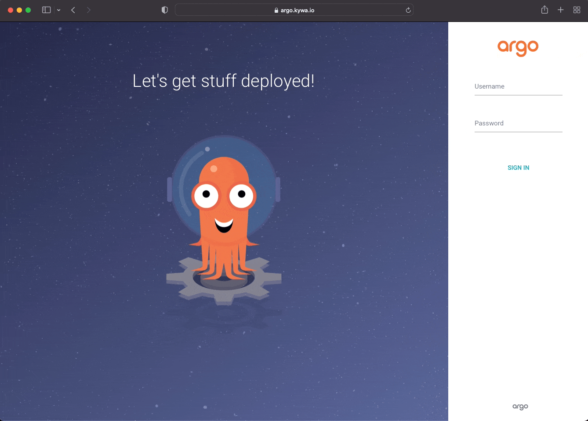
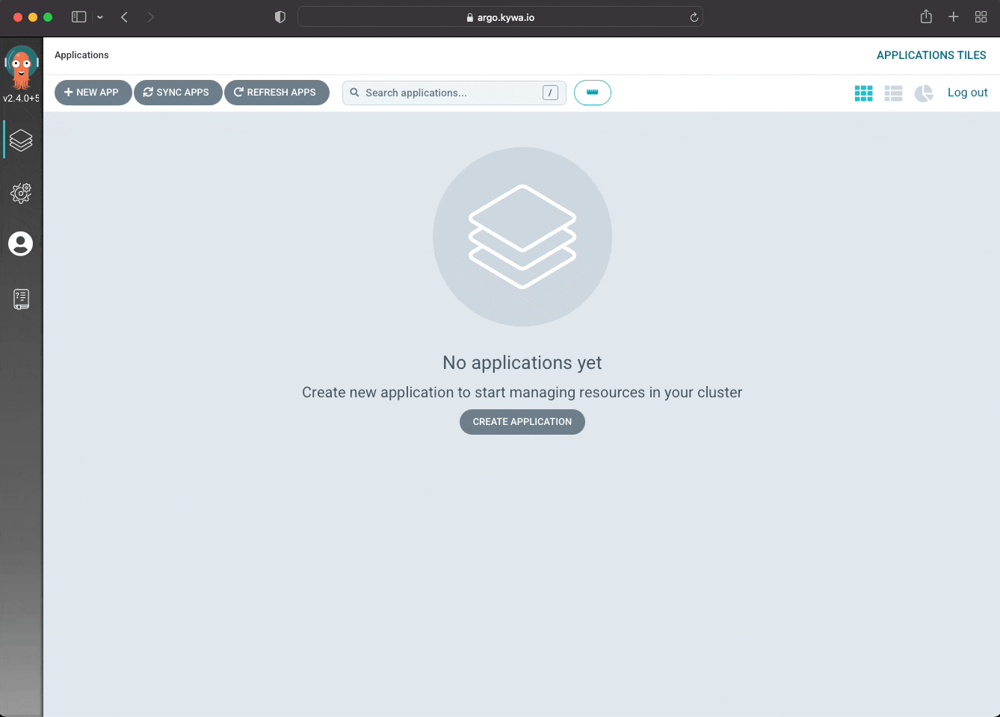
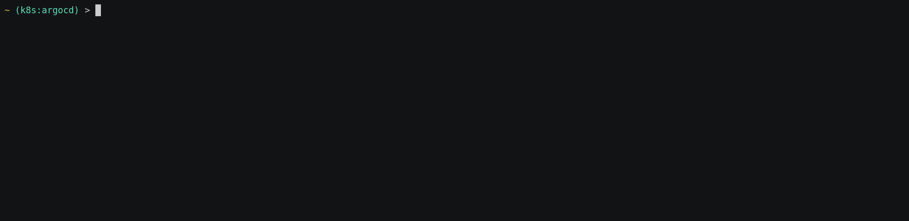
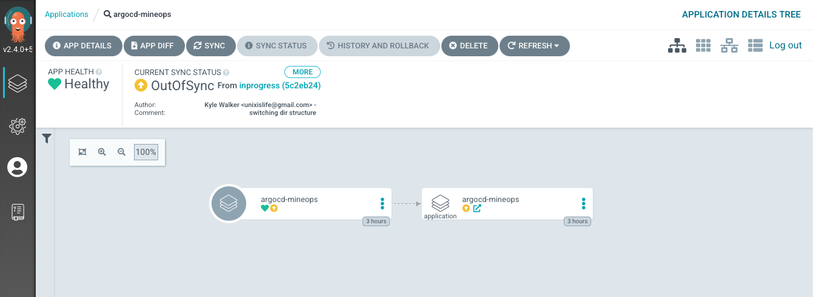
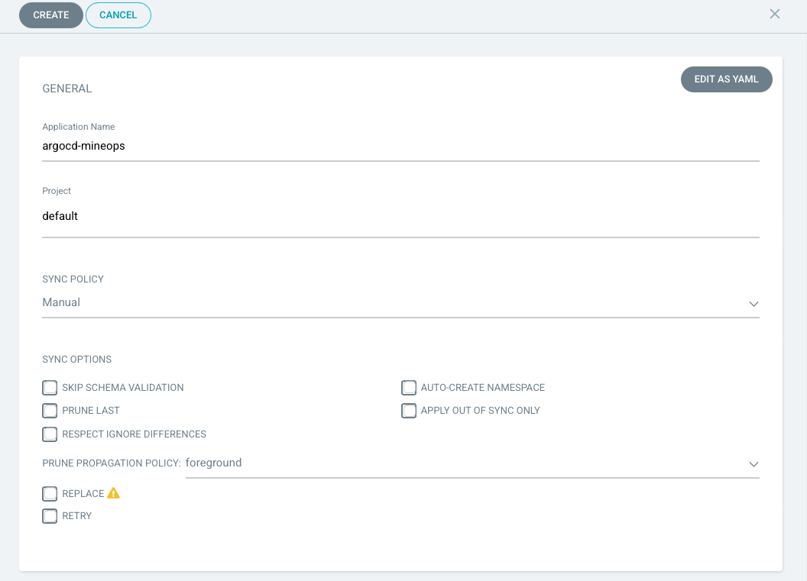
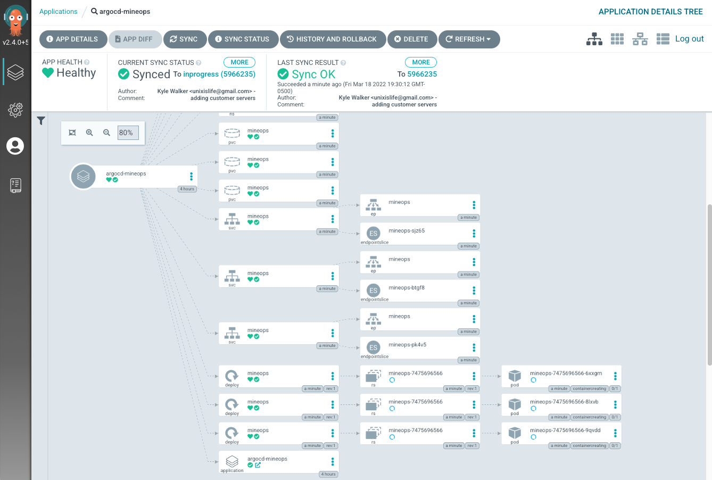
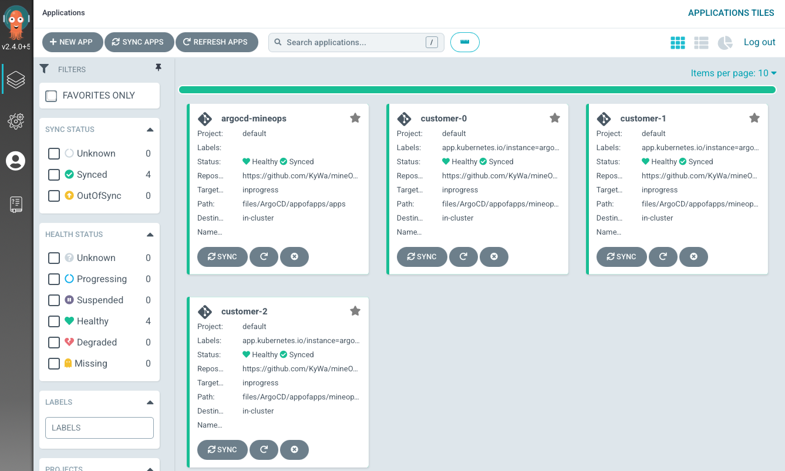
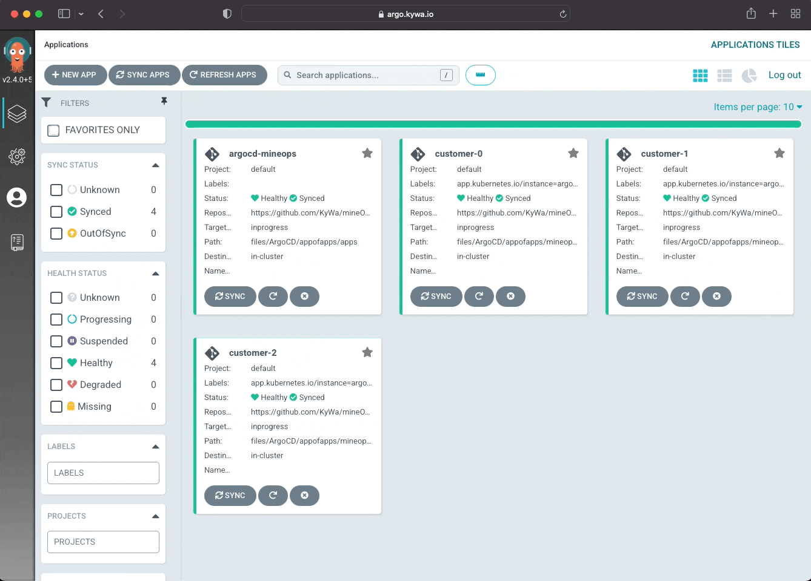
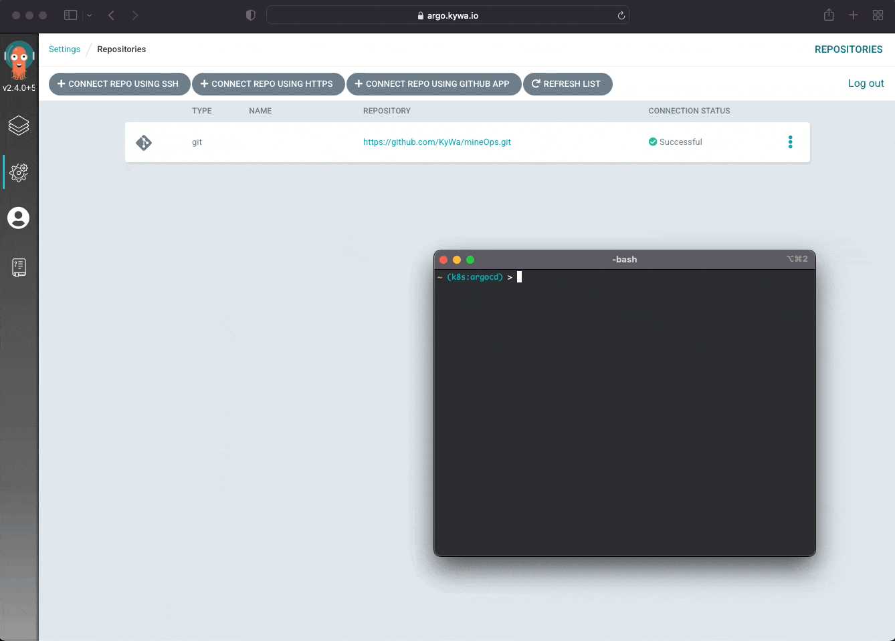

# ArgoCD for mineOps

Since it seems we are now using Kubernetes and our CEO is happy and doesn't appear to be playing buzzword bingo anymore, its time to do something for us to make our lives easier. After spending some time scouring the internet, it looks like we may have found what we need, [ArgoCD](https://argoproj.github.io/cd/). It seems like we've heard it come up in our Twitter feeds, Reddit and wherever else dope technology is talked about. It seems like it handles GitOps, whatever that is, but most importantly it keeps manifests applied and correct in our Kubernetes cluster(s). But what does that really mean? Let's take a tour of what ArgoCD is and how it is going to help us manage all of these customer Minecraft Servers running on Kubernetes.

## What are we trying to solve?

Since we now have our customer Minecraft Servers running on Kubernetes and we can create new ones with `kubectl create`, do we wan't to keep up with a `kubecofig` for each person on our development team, what do we do? We can keep doing this, but it gets tiring having to get more `kubeconfig`s for each new team member and really doesn't make auditing super easy (really borderline impossible in a vanilla Kubernetes cluster). There may be some other items, but here are our core focuses on what we are needing for our sanity:

* An easy way to deploy new customer Minecraft Servers
* Not require giving new team members a `kubeconfig` file
* Some form of auditing of who created/deployed what

### How does ArgoCD help us?

Thankfully based on the items we have determined above, ArgoCD can handle most of these items (and more) without really having to change much of what we do. That is fine and dandy saying that, but what exactly does ArgoCD "do"? Argo itself is actually just the name of a group of projects (and a company I guess?) with ArgoCD being one of those projects. The CD stands for Continuous Delivery, which is something that up until now "we in this company" haven't really ever dealt with. In short it takes changes you've made (ideally in a Git repository somewhere) and then... continuously delivers/deploys them. On the surface it is actually quite simple, but the how and when is what is important. So that seems to lead mostly to an answer for the first item in our list, but does leave us still with the "how" of it. In [Part 3](https://blog.kywa.io/mineops-part-3/) we moved all of our configuration files into Git and they are just sitting there doing nothing. What if they could "do" something? This is where ArgoCD comes in and the "how" of the CD portion of its namesake. ArgoCD can be utilized to implement a neat framework that some may consider a "buzzword" (we can use those too if we want Mr. CEO) called GitOps, but it is so much more than just a buzzword. It is honestly an amazing way of handling the automation of your CI/CD changes and really shines in a matured DevOps culture, which hopefully by now we can consider ourselves that.

For the issue of getting new team members access to Kubernetes to be able to run `kubectl` commands against, we don't even need to bother with that. ArgoCD itself (typically) lives in the Kubernetes cluster as its own application and is checking a Git repository (or even a Helm Repository for those who've gone a little further in their Kubernetes maturity) for any changes. Since every team member in theory who is going to be making changes, would use Git, nothing needs to be changed in terms of an access model to our Kubernetes clusters. ArgoCD only cares about what is in the cluster and what is in Git. You don't even really need to grant anyone access to ArgoCD itself unless there is some form of an issue. 

With the previous question answered, we technically also have our answer as to what we need for some form of audit. Git handles auditing very, very well, so well in fact as stated before, you can literally use the word `blame` to find out who changed what in a file. Between this existing functionality of Git and using Pull Requests that require approvals/reviews, we can easily audit what changes actually go into our cluster. On top of those things, ArgoCD itself has a pretty amazing view of who did what right from the UI, which is really just reporting what Git says. 

We've roughly got our what we believe we need to make this all work right out of the box with ArgoCD and Git. And we've got our "buzzword" GitOps, which is something we are really going to focus on. In a perfect world, no one would have direct access to our Kubernetes clusters and we would have everything audited through Git, applied via ArgoCD and happily running with 0 manual intervention. We can absolutely get here and there is nothing stopping us from doing that outside of a little growing pain.

### The "Endgame" of GitOps

Without violating an Hollywood IP, the "End Game" of GitOps is quite simple, Git is the single source of truth. In theory its simple, in practice it can be challenging. Thankfully with ArgoCD it becomes quite doable. How this would look fully implmeneted is this:

* k8s Cluster is created
* ArgoCD is installed and configured
* `kubeadmin` config is stored in some secrets management tool that no one can access directly
* Any and all changes to the cluster are made through ArgoCD
* No one uses `kubectl` to get or do anything

For most of us who are admins, or who used to be admins, the idea of not having any visibility into our clusters or workloads sounds horribly scary. There are times where it can be for sure, but so long as there is a good Git review process and competent people are writing code changes, it doesn't have to be. With ArgoCD (as we will see) you have quite a bit of visibility into what is going on with your cluster(s) and if you have done some Day 2 activities such as having monitoring for your cluster, you don't really "need" `kubectl`. I will admit though not having direct access does make for a nerve racking scenario sometimes, but if done correctly, implementing GitOps will keep manual "tweaks" from being performed without anyone's knowing.

For more information on GitOps, check out [this](https://about.gitlab.com/topics/gitops/) post from GitLab.

## Installing ArgoCD

As discussed during the outline of ArgoCD I mentioned that ArgoCD typically lives in the Kubernetes cluster where it is deployed. There are other methods where you could technically have a "central" ArgoCD that manages multiple Kubernetes clusters. We will not be focusing on that method as it requires quite a bit more setup and there is nothing lacking if we have 1 ArgoCD instance per Kubernetes cluster (especially since we aren't growing past this during the mineOps series).

### Raw Manifests

Ideally the best way to install ArgoCD is up to the team who is going to be doing the actual install. The method we are going to pursue is through just normal YAML manifests. I would personally use Helm to deploy this, but learning Helm isn't a necessary for the mineOps series, but a follow up post may be in the works. The fastest way to get the ArgoCD manifests is to obtain them from the [Argo Project's GitHub repository for ArgoCD](https://github.com/argoproj/argo-cd). In this repository there are many great things to look at, but for the most part we are primarly focused on one directory and that is the `manifests` directory which contains the most obvious of YAML files, `install.yaml`. We breifly mentioned this in Part 5, but `kubectl` can be used to target not just local files, but also URLs as well. It looks just like how we would normally apply a manifest, so lets get it going:

```yaml
$ kubectl create namespace argocd
namespace/argocd created
$ kubectl apply -n argocd -f https://raw.githubusercontent.com/argoproj/argo-cd/master/manifests/install.yaml
customresourcedefinition.apiextensions.k8s.io/applications.argoproj.io created
customresourcedefinition.apiextensions.k8s.io/applicationsets.argoproj.io created
customresourcedefinition.apiextensions.k8s.io/appprojects.argoproj.io created
serviceaccount/argocd-application-controller created
serviceaccount/argocd-applicationset-controller created
serviceaccount/argocd-dex-server created
serviceaccount/argocd-notifications-controller created
serviceaccount/argocd-redis created
serviceaccount/argocd-server created
role.rbac.authorization.k8s.io/argocd-application-controller created
role.rbac.authorization.k8s.io/argocd-applicationset-controller created
role.rbac.authorization.k8s.io/argocd-dex-server created
role.rbac.authorization.k8s.io/argocd-notifications-controller created
role.rbac.authorization.k8s.io/argocd-server created
clusterrole.rbac.authorization.k8s.io/argocd-application-controller created
clusterrole.rbac.authorization.k8s.io/argocd-server created
rolebinding.rbac.authorization.k8s.io/argocd-application-controller created
rolebinding.rbac.authorization.k8s.io/argocd-applicationset-controller created
rolebinding.rbac.authorization.k8s.io/argocd-dex-server created
rolebinding.rbac.authorization.k8s.io/argocd-notifications-controller created
rolebinding.rbac.authorization.k8s.io/argocd-redis created
rolebinding.rbac.authorization.k8s.io/argocd-server created
clusterrolebinding.rbac.authorization.k8s.io/argocd-application-controller created
clusterrolebinding.rbac.authorization.k8s.io/argocd-server created
configmap/argocd-cm created
configmap/argocd-cmd-params-cm created
configmap/argocd-gpg-keys-cm created
configmap/argocd-notifications-cm created
configmap/argocd-rbac-cm created
configmap/argocd-ssh-known-hosts-cm created
configmap/argocd-tls-certs-cm created
secret/argocd-notifications-secret created
secret/argocd-secret created
service/argocd-applicationset-controller created
service/argocd-dex-server created
service/argocd-metrics created
service/argocd-notifications-controller-metrics created
service/argocd-redis created
service/argocd-repo-server created
service/argocd-server created
service/argocd-server-metrics created
deployment.apps/argocd-applicationset-controller created
deployment.apps/argocd-dex-server created
deployment.apps/argocd-notifications-controller created
deployment.apps/argocd-redis created
deployment.apps/argocd-repo-server created
deployment.apps/argocd-server created
statefulset.apps/argocd-application-controller created
networkpolicy.networking.k8s.io/argocd-application-controller-network-policy created
networkpolicy.networking.k8s.io/argocd-dex-server-network-policy created
networkpolicy.networking.k8s.io/argocd-redis-network-policy created
networkpolicy.networking.k8s.io/argocd-repo-server-network-policy created
networkpolicy.networking.k8s.io/argocd-server-network-policy created
```

Based on the output above, we have just created quite a few new objects in our cluster. For the most part this is just a bunch of RBAC rules to allow the various compontents of ArgoCD to do all of the things it does. The rest is really just the actual deployments of the ArgoCD components of which there are a few. We will break down each component just a little bit, but knowing each component isn't 100% necessary for using and working with ArgoCD so we will only go over the main ones that you'd realistically ever need to look at:

* ArgoCD Server - This handles the UI elements and is where the API server lives that hanldes the "running" of ArgoCD
* ArgoCD Application Controller - Continuously monitors running `Applications` and compares their state with what is cached in Git
* ArgoCD Repo Server - Manages the repositories and provides a local cache of each Git repository holding application manifests

### Accessing ArgoCD

Now that we've covered the various components that we've installed, it is time to actually "see" and use ArgoCD, but with all things Kubernetes that have some form of GUI component, we will need some form of Ingress to access it. To access the web front end of ArgoCD, we will need an `Ingress` object to route our traffic to ArgoCD. Here is a simple manifest for such an Ingress object. Please note you do not actually need to use the web front end to make use of ArgoCD as it will work on its own, but if you wish to use the `argocd` client or view from the web front end to manage things, you will need an `Ingress` object (or a Gateway/VirtualService etc...). You could also technically use the `kubectl port-forward` function, but that isn't very realistic or scalable since we are using this in a cluster used by many (in theory).

```yaml
apiVersion: networking.k8s.io/v1
kind: Ingress
metadata:
  name: argocd
  namespace: argocd
  annotations:
    kubernetes.io/ingress.class: nginx
    nginx.ingress.kubernetes.io/force-ssl-redirect: "true"
    nginx.ingress.kubernetes.io/ssl-passthrough: "true"
    nginx.ingress.kubernetes.io/backend-protocol: "HTTPS"
spec:
  rules:
  - host: "argo.kywa.io"
    http:
      paths:
        - path: /
          pathType: Prefix
          backend:
            service:
              name: argocd-server
              port:
                name: https
  tls:
  - hosts:
    - argo.kywa.io
```

**NOTE** Some of these annotations can be removed by changing the configuration of ArgoCD's settings in the ConfigMap `argocd-cm`, but are required for a "default" installation of ArgoCD along with `ingress-nginx`.

ArgoCD is deployed and seems to be up and running, we can get to the web application, but we don't have any login credentials. By default ArgoCD creates an initial admin password which can be found in a secret in the namespace that ArgoCD is installed in. To view the `Secret` and get the password to login initially here is a quick handy one liner:

```sh
$ kubectl get secret -n argocd argocd-initial-admin-secret -o jsonpath='{.data.password}' | base64 -d
Z1Ha6-z8QVR2jC0b
```

Later in this guide we will be doing things in a more declarative process and will not be needing to obtain this secret manually or even use it potentially for that matter. Now let's try to login to our newly installed ArgoCD instance.

[](#)

## Using ArgoCD

Now that we've logged into the UI, we are met with an amazingly detailed blank screen that tells us "No applications yet". So let's breakdown what an `Application` is real quick. An `Application` is a CustomResource provided by the ArgoCD controller which manages an "application". For some an "application" could be a Helm Chart, a Kustomize "application" or a directory of manifests. We will be looking at 2 of these style `Applications` with a primary focus on the directory style as it is probably the more useful for us deploying Minecraft Servers. Since ArgoCD is being used as a GitOps tool, we need to get ArgoCD to talk to Git somehow and from the Applications page we are on, there is no obvious path to this.

### Creating an Application

With ArgoCD there are many ways to create an `Application` and we will outline the 3 most used (and currently the only 3 known) methods for creating an `Application` in ArgoCD.

#### ArgoCD UI

First up is the ArgoCD UI which we are already in, so this makes the most sense to do first. Let's see what we get if the click the "CREATE APPLICATION" button in the middle of our screen.

[](#)

After passing in some information such as which Git repository to target and the name of our `Application` we get more changes than we were probably expecting. As we can see the UI has changed drastically from whwen we first logged into ArgoCD. There are now filters and statuses we can view, with labels and all sorts of things to click on. Since we have added an `Application` to our cluster and we can view what the `Application` is doing by clicking on it from the ArgoCD UI. This first `Application` is really nothing more than "applying" itself based on what we gave ArgoCD during its creation. Upon clicking the `Application` called "argocd-mineops", we are taken to a different view where we can see the name of our application pointing to another item named "argocd-mineops". This "other" object sharing the name is showing that the `Application` we created is applying manifests in the `files/ArgoCD/basic` directory.

#### Declarative

As with literally everything in the Kubernetes world, it can all be boiled down to a manifest and ArgoCD is no different. The same application we created from the UI can also be created through a Kubernetes manifest. Here is what it would look like and can be applied via the normal `kubectl create -f` method as with everything:

```yaml
apiVersion: argoproj.io/v1alpha1
kind: Application
metadata:
  name: argocd-mineops
  namespace: argocd
spec:
  destination:
    server: https://kubernetes.default.svc
  project: default
  source:
    directory:
      jsonnet: {}
      recurse: true
    path: files/ArgoCD/basic
    repoURL: https://github.com/KyWa/mineOps.git
    targetRevision: master
```

#### ArgoCD CLI

And for the "last" option to work with ArgoCD is the `argocd` CLI. This may be useful to some, but once you have ArgoCD setup and your Git repository the way you and your team want it, you may not have much reason (initially) to use the `argocd` CLI. It does have some neat features for more advanced usage, but for what we will be doing, it isn't needed. To get the `argocd` CLI installed check the [official ArgoCD docs](https://argo-cd.readthedocs.io/en/stable/cli_installation/).

Let's at least see how to use it though and as with most tools you will need to authenticate so you can actually communicate:

[](#)

To create the same `argocd-minops` `Application` as above, we would run the following:

[](#)

As you can see, the `argocd` CLI is pretty straightforward and has very logically named flags for the various commands, but takes way more typing to get an `Application` created than having a manifest to apply or using the UI. The option is there though for those who wish to use it.

---

With an `Application` defined and the ability to check its current status we have done the core of what you will ever need to do with ArgoCD. However you may have noticed that our `Application` showed "Out of Sync" and that it had a Yellow color as opposed to Green. Most of us know that Green is good and Yellow is typically a warning of some kind. This is still the case with ArgoCD and we can dig into why that is in a later section.

### Using the ArgoCD UI

Now that we've created an `Application` and have it in our ArgoCD instance, what do all the fancy UI elements mean? Thankfully they are quite self-explanitory, but we can look at them for a little bit. On the top row of the default layout we have a few buttons to look at:

* `NEW APP` - This takes you to the same screen we were on previously when adding our `Application`
* `SYNC APPS` - Initiates a manual sync on all `Applications` (or a selection)
* `REFRESH APPS` - Tells ArgoCD to check in with Git and refresh the state of `Desired` for the selection `Applications`. This is normally done on its own every 5 minutes by default 

When using the UI, the latter 2 are probably the only buttons you will click from the main `Application` page. Things get a little deeper once you click on an `Application` and can see more choices.

[](#)

* `APP DETAILS` - Takes you to the `Application` itself to view its status and information
* `APP DIFF` - Also takes you to the above page, but specifically to the `DIFF` tab
* `SYNC` - Same as the `SYNC APPS` button from the main `Application` page, but only for this `Application`. Can also choose which resources to sync
* `SYNC STATUS` - Looks at the sync status of all objects in the `Application`
* `HISTORY AND ROLLBACK` - Shows the history of the `Application` and each Git Commit that was targeted. Rollback is only available for non Automated sync policies
* `DELETE` - Should be self-explanitory, but deletes the `Application` (and its resources if `prune` is enabled)
* `REFRESH` - Also the same as the `REFRESH APPS` button from the main `Application` page

The UI does have some handy features, but as stated previously, once everything is "up and running" there may not really be a need to revisit the UI unless an issue occurs. And even still, the `Pod` logs for each component will tell you what the issue is, but may be easier to track down via the UI.

## ArgoCD Sync Features

Previously we added an `Application` to ArgoCD that immediately showed "Out of Sync". That isn't because our application was extremely complex or that our co-worker was updating the same manifest behind our back, but it was because of something that ArgoCD does on its own we didn't account for. The way in which ArgoCD manages the state of `Applications` is by checking its `Live` state against the `Desired` state. The `Desired` state is what we have in our Git repository, but ArgoCD also does some magic on its side after it gets the manifests from Git. ArgoCD, when it creates/applies manifests, adds labels to identify that it is managing those objects and updates the `Desired` state to reflect that. When the `Live` and `Desired` states do not match, we are "Out of Sync", but since our `Live` manifest is the one out of sync, why doesn't ArgoCD do something about it? 

### Manual

For those who looked closely at what what our UI showed when creating our argocd-mineops `Application`, you will remember that the "Sync Policy" was set to manual and no options were checked just as in the screenshot below:

[](#)

The Manual sync policy is there to be more of a "hey things are good, bad or mostly ok" and does not do anything outside of warn the user. In some cases it has merit, but really defeats the purpose of ArgoCD and GitOps in general in my own personal opinion.

### Automated

An Automated sync policy is where ArgoCD really shines as it will enforce any deviation from the `Defined` application and the `Live` state of the `Application` in the cluster. Essentially how this works is if you had an object in your Kubernetes cluster, lets say a `ConfigMap`, defined in Git, if someone modified the `ConfigMap` via `kubectl`, ArgoCD would immedietly detect the change and apply the `Desired` manifest. This is extremely powerful and very handy, but there are some things to be aware of. If you put your Kubernetes cluster resources inside of Git (certificates, CRDs, etc..) ArgoCD will enforce them as they are, but there may be times where you run into an issue where Kubernetes updates a specific resource. It could be something as simple as a label or annotation, or it could be a block of configuration, but if ArgoCD detects a deviation from what is defined in Git it will continually re-apply the `Desired` manifest, sometimes leading to ArgoCD having issues or the cluster being put into a "unique" state. These "differences" were thought about when ArgoCD was designed and thankfully can be handled easily in the `Application` specification through an `ignoreDifferences` block. The [official ArgoCD docs](https://argo-cd.readthedocs.io/en/stable/user-guide/diffing/) outline how to use it and when to use it, but the quick and dirty is that you can use it in the `Application` spec or at a global level (which can be handy depending on the type of object).

The 2 main options when selecting an Automated sync policy that we will care about for now are the 2 check boxes beneath AUTOMATED when choosing it from the drop down. These 2 options are:

* `prune` - Tells ArgoCD to delete objects no longer defined in Git (disabled by default)
* `selfHeal` - Enforces `Desired` to `Live` self healing (semi-disabled by default)

With an Automated sync policy, by default the manifests will not be force synced without `selfHeal` being set to true except in a few scenarios:

* An automated sync will only be performed if the `Application` is OutOfSync. `Applications` in a Synced or error state will not attempt automated sync.
* Automated sync will only attempt one synchronization per unique combination of commit SHA1 and application parameters. If the most recent successful sync in the history was already performed against the same commit-SHA and parameters, a second sync will not be attempted, unless selfHeal flag is set to true.
* If `selfHeal` flag is set to true then sync will be attempted again after self heal timeout (5 seconds by default) which is controlled by `--self-heal-timeout-seconds` flag of argocd-application-controller deployment.
* Automatic sync will not reattempt a sync if the previous sync attempt against the same commit-SHA and parameters had failed.
* Rollback cannot be performed against an application with automated sync enabled.

As you can see the Automated sync policy on its own will handle most of the common use-cases, but there is typically 0 reason to not set `selfHeal` to true as it really does enforce the configuration. The only time you may wish to consider not setting `selfHeal` to true is when initially testing new items and do not want to cause issues (as seen above with differences).

In YAML form an automated sync policy will look something like this:

```yaml
spec:
  syncPolicy:
    automated:
      prune: true
      selfHeal: true
```

There isn't much else to outline here on the Automated sync policy for our uses, but there are plenty more definitions for sync options that can be read up on here: https://argo-cd.readthedocs.io/en/stable/user-guide/sync-options/)

## Repository Setup

So we've got a decent understanding of ArgoCD, how it works and what it targets to enforce a desired state. So let's look at what our setup looks like under the guise of our Minecraft Servers as we will have a few variations here very shortly. Our first configuration will be what we've already seen, a single `Application` that targets a directory in a repository and then recursively enforces the manifests in that directory. We will call this the "basic" setup of our Git repository. This is without a doubt the simpliest setup we can use, but does have some shortcomings. With our one `Application` we will get what we need with our customer Minecraft Servers being applied, but we have one `Application` that will grow in size and not be very "modular". Let's look at what this looks like in the UI using a single ArgoCD `Application` to manage all of our customer deployments.

[](#)

As you can see by the very zoomed out screenshot, we have our one `Application` enforcing all 3 of the customer Minecraft Servers, but thats it, it is one single `Application` with one Status. This gives us much less insight into what is actually going on, what if a customer Minecraft Server gets changed by someone on our team, or what if there are issues with one of the manifests? It is very difficult (assuming at a much larger scale than 3) to track down which instance is having issues. This is where the concept of "App of Apps" comes in. You have an ArgoCD `Application` manage the state of other ArgoCD `Applications`. Let's see what this looks like from a realish scenario.

### App of Apps

App of Apps does create more initial overhead and requires a little bit of design work, but the payoff is huge in the long run as it allows us to have an `Application` per customer (in our case). In a more real world Kubernetes scenario, the possibilities are endless and the benefits remain the same. Maybe you have one `Application` with its sole purpose to keep all cluster configuration `Applications` in place. Or you could have one `Application` manage an actual application such as Hashicorp Vault or a VS Code Server group for your developers.

For our test Git repository, here is what the layout will look like:

```sh
$ tree appofapps/
appofapps/
├── apps
│   ├── customer-0.yaml
│   ├── customer-1.yaml
│   └── customer-2.yaml
├── argocd-mineops.yaml
└── mineops-servers
    ├── customer-0
    │   └── mineops-0
    │       ├── mineops-configmap.yaml
    │       ├── mineops-deployment.yaml
    │       ├── mineops-namespace.yaml
    │       ├── mineops-pvc.yaml
    │       └── mineops-service.yaml
    ├── customer-1
    │   └── mineops-1
    │       ├── mineops-configmap.yaml
    │       ├── mineops-deployment.yaml
    │       ├── mineops-namespace.yaml
    │       ├── mineops-pvc.yaml
    │       └── mineops-service.yaml
    └── customer-2
        └── mineops-2
            ├── mineops-configmap.yaml
            ├── mineops-deployment.yaml
            ├── mineops-namespace.yaml
            ├── mineops-pvc.yaml
            └── mineops-service.yaml
```

Our "main" `Application` is the `argocd-mineops.yaml` manifest which watches the `apps/` directory and enforces the manifests there. The `apps/` directory itself contains its own `Application` for each customer which is watching the respective directory under `mineops-servers` and enforces those manifests. Below is what each `Application` is targeting so you can see the "tiered" approach:

```yaml
# argocd-mineops Application
spec:
  source:
    path: files/ArgoCD/appofapps/apps

# customer-0 Customer Application
spec:
  source:
    path: files/ArgoCD/appofapps/mineops-servers/customer-0

```

From a UI perspective, lets take a look at how this plays out:

[](#)

We ultimately still get the same result, but having each customer in its own `Application` it makes it easier to group and single out a specific configuration. There are some who say it would be fine from having a single `Application` manage an entire Git repository full of manifests, but this approach is cleaner and allows for more granular and potentially less destructive changes in the event of an accidental Git deletion.

## Extras and Nice to Haves

We've gone over just about every core thing in ArgoCD that we will need to manage our customer Minecraft Servers and everything to get going with your own ArgoCD instance for managing Kubernetes clusters. There are a few things that we didn't look at during Part 5 of the MineOps series and that is Kubernetes `Secrets` because we didn't have a need for them. Well, we will be looking at them here as they are important in the grand scheme of Kubernetes management.

### Secrets

A Kubernetes `Secret` is basically the same thing as a `ConfigMap` with one exception, they are `base64` encoded. Spoiler time for those who don't know, but encoding != encryption. They do serve a purpose however and that is being a separate and unique object that can be managed via RBAC so other's cannot actuall view the data inside. Almost all Kubernetes native applications make use of Secrets. They can be blank objects that get updated by something in the cluster for dynamic secrets that are more secure as they are dynamically generated and updated not by a user. Well if we are going to add Secrets to Kubernetes and store them in Git, this presents a huge issue. Any `base64` encoded value can be easily obtained by simply running the following:

```sh
$ echo "c2VjcmV0cGFzc3dvcmQ=" | base64 -d
secretpassword
```

With that in mind, how do we store a `Secret` in Git if it is easily retrieved? Well, you don't technically because of that very reason, however there are many amazing tools to make this not so much of an issue. [Bitnami Sealed Secrets](https://github.com/bitnami-labs/sealed-secrets) is a pretty awesome one as it allows you to encrypt values and store them in Git which can then be decrypted in cluster via `kubeseal`. Another great one is [Hashicorp Vault](https://www.vaultproject.io/) which does things a little different and has way more overhead than the Bitnami option. We will not be playing around with either tool as we have no real need to store `Secrets` in Git, but it is important to know how you would handle these in your own real world scenario. ArgoCD can make use of both of the aforementioned tools and decrypt the `Secret` values and inject them into the cluster without anything being exposed in Git or otherwsise, so have fun and choose a tool that works for you and your team.

As for actually creating `Secrets`, there are a few ways. The easiest is through `kubectl create secret` as this allows you to "target" a file and create a `Secret` with its data being the value and the filename being the key. You can also create it declaratively through a manifest and this can be done in two different ways actually. The first of which is creating it with pre-encoded values and you specify it like so:

```yaml
kind: Secret
data:
  type: Z2l0
```

Or you can have Kubernetes encode it for us by using the `stringData` type:

```yaml
kind: Secret
stringData:
  type: git
```
```sh
$ oc get secret somesecret -o yaml
kind: Secret
data:
  type: Z2l0
```

There are a few other ways, but these are the more common ways of creating `Secrets`.

### Private Repositories

What if our Git repository isn't public? How does ArgoCD get the credentials to communicate with a private repository or one behind an organization that isn't public? We know that ArgoCD manages objects through an `Application`, but nowhere during its creation did we get a place to put in credentials of any kind. This is where we get to explore the ArgoCD UI a little more and look at a way to do this declaratively through a `Secret` manifest. The reason its done through a `Secret` is that is how ArgoCD stores private repositories.

#### GUI

Since we are probably still in the UI somewhere, lets see where we go and how we add in a Private Repository, which are just listed as Repositories inside of ArgoCD.

[](#)

Now that we've created a repository (please note I did not include a username/password as I'm too lazy to blur out the data) we can see how ArgoCD stored that in our cluster:

```sh
$ kubectl get secret repo-1593074683 -o yaml
apiVersion: v1
data:
  project: ZGVmYXVsdA==
  type: Z2l0
  url: aHR0cHM6Ly9naXRodWIuY29tL0t5V2EvbWluZU9wcy5naXQ=
kind: Secret
metadata:
  annotations:
    managed-by: argocd.argoproj.io
  creationTimestamp: "2022-03-19T01:11:24Z"
  labels:
    argocd.argoproj.io/secret-type: repository
  name: repo-1593074683
  namespace: argocd
  resourceVersion: "545945"
  uid: 73dc7ef2-fadf-4279-9e3c-ba69cea10445
type: Opaque
```

Knowing this is how ArgoCD stores it, that leads us into the other way to add a private Git repository to ArgoCD.

#### Declarative

Using the previous example as our "base" and using a different repository style (git vs http) we can create a new `Secret` which contains a repository configuration for ArgoCD to use.

```yaml
apiVersion: v1
stringData:
  name: argo-repo
  sshPrivateKey: ssh-rsa AAAA0192k301j0192j3019j2301923-----
  type: git
  url: git@github.com:KyWa/mineOps.git
kind: Secret
metadata:
  name: mineops-repo
  namespace: argocd
  annotations:
    managed-by: argocd.argoproj.io
  labels:
    argocd.argoproj.io/secret-type: repository
type: Opaque
```

The data inside is obviously important, but what is key here is the label `argocd.argoproj.io/secret-type: repository` as this is picked up by ArgoCD and knows that this is a "repository" for it to use. The rest of the data is self-explanitory and using a Git repository and connecting over SSH. **NOTE** If you are using a private Git repository over SSH, your ArgoCD `Applications` will need to reflect this as well.

Let's create the repository from our `Secret` and see if ArgoCD picks up the Git repository:

[](#)

And that is the other method for creating a private Git repository for ArgoCD. Now obviously for similar reasons as mentioned before, you wouldn't store this in Git itself because its completely readable by all (at least those who know how to pass a value to `base64`) so a different solution for storing this will be required for the sake of security.

## Wrapping Up

Hopefully throughout this post you can see that ArgoCD isn't all that complicated and for most teams, this is the core use of it, but can easily be expounded upon as teams grow. There are other alternatives (or even pairings) such as [Flux](https://fluxcd.io/), but that is outside the scope of this series.

I hope you've enjoyed this blog series on MineOps and exploring the growth a company may see moving up the DevOps tool chain. There may be a follow up post to cover a few other items in small detail, but this final post wraps up the official series. It is possible that I may go over this in a livestream and go through the entire series, step by step for those who wish to take part and see all of this happen in real-time.

### Series Links:
* [Part 1 - Manual Minecraft Server Installation](https://blog.kywa.io/mineops-part-1/)
* [Part 2 - Automating with Ansible](https://blog.kywa.io/mineops-part-2/)
* [Part 3 - Keeping it Altogether with Git](https://blog.kywa.io/mineops-part-3/)
* [Part 4 - Containers Have Joined the Party](https://blog.kywa.io/mineops-part-4/)
* [Part 5 - Making Containers Highly Available](https://blog.kywa.io/mineops-part-5/)
