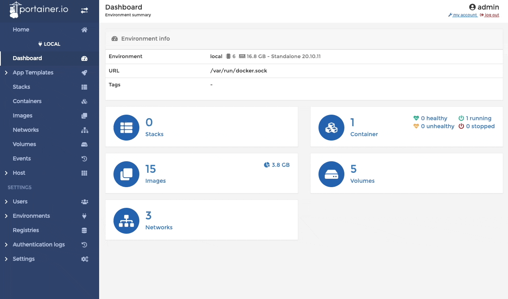

# Docker for mineOps

Despite things going well, our CEO has heard about a buzzword called "containers" and its our job to make this a reality. So let's start this journey of containerizing our Minecraft Servers and ultimately cut-over our customers if we can make it work.

## What is a Container

Currently our company (in theory) is using virtual machines to host Minecraft Servers for our customers which is using a technology called "Virtualization". It has been around for quite some time and has some amazing adoption as it really allows you to utilize the most out of your physical hardware. Containers are not virtual machines. This is a common misconception by most people making the jump to Containers, but is quite untrue. I know people in my industry who know this yet continue to treat their Containers like virtual machines and I hope during this guide we can cover why you wouldn't do that and how easy it is to go down that road.

Another misconception is that Containers are Docker Containers or that Docker is the only Container "type" out there.  Docker has become synonymous with Containers just like the term SLI did for multiple GPUs (even if using AMD Crossfire) or Kleenex just meaning a tissue. This is unfortunate as there are other Container engines out there and this is something else I hope to dispel in this post.

We don't have to go over the entire history of Containers and what they are in reality ([kernel namespaces](https://en.wikipedia.org/wiki/Linux_namespaces) which have been around in Linux since the turn of the millennium), but know that UNIX had their own equivalent (for the most part) developed back in 1979 and live by the early 80s. I will simply what they are for everyone's sake. Containers in theory are just another PID/Process on a server. Obviously there is a bit more to it than that, but it's best to think of them as processes. You can and will have more processes in side this Container, but the core of the Container should be thought of as a single process. Failing to do this will lead to bloat and have VM sized Containers and defeating a lot of the advantages to using Containers.

The large benefit of Containers over Virtual Machines is the overhead. A Virtual Machine is an entire Operating System with all of its libraries and software making its "package" the size of, well , an Operating System. If you wanted to run an Apache Web Server (`httpd` for the cool kids) on a Virtual Machine you would have to have an entire Virtual Machine or a physical server with Apache installed and then your website/web application along with it. A Container on the other hand can be as small as the actual application and data itself and nothing more. In the example of Apache, this could be as small as 10MB as opposed to the same VM with Apache installed being probably 4GB+. The benefits of containers is far more than just the size of the "package" (Virtual Machine vs Container Image) and hopefully we will see this benefit here shortly as we go through this guide.

### Container Images

In the previous sentence I mentioned a new concept called a Container Image. If a Virtual Machine is comprised up of an entire Operating System and its installed software, a Container Image is just a packaged application and its dependencies along with information on what processes it runs when launched. Container Images typically tend to be quite small, but when starting out most people end up with larger Container Images as they learn how to build their own. We will go over building our own Minecraft Server Container Image later in this guide.

One interesting thing about Container Images (and other things in the modern tools and applications) is the concept of a `tag`. With Container Images since they are just a packaged application you can use `tags` to identify what version of your application a Container Image has. The format looks like this: `minecraft-server:1.18.1`. If a `tag` is not specified (both when building an Image or running a Container) the `tag` called latest will be used in its place. We will go over `tags` and latest later in this guide.

For Container Images, all we need to know now is that its a packaged application, which we can tag to show the version inside. For us we will end up building a Minecraft Server image.

### So what is Docker then?

Previously we stated that Docker != Containers and that Containers != Docker, but anytime we look at something related to Containers we see Docker. Why is that the case if the concept of Containers has been around longer than Docker the company? The reason Docker is so synonymous with Containers is that it was because of Docker (both the company and the application) that brought Containers to the forefront of IT nearly a decade ago now. A talk was made and people started using Containers through Docker (the application/engine) and here we are today, however Docker isn't the only Container "runtime" in town.

Without doing a large deep dive on the concept of what a [Container Runtime](https://opensource.com/article/21/9/container-runtimes) is, essentially its the "low level" program that runs Containers. Now we will discuss what a Container Engine is. Container Engines are applications we humans can use to manage, package and run containers (Container Engines come with their own Container Runtime). Docker is one of these Container Engines (and arguably the most popular by far) and for sure the one most widely available for Desktop Operating System usage. But in the wise words of Yoda...

[](#)

[Podman](https://podman.io/) is fairly new to the scene of Container Engines, but it comes packed with a ton of features. For most beginners though, these features wont be realized until growing a little more in your journey with Containers. When it comes to developing Container Images and running Containers both Podman and Docker ultimately do the same thing, but how they do it is slightly different. 

Docker runs in a daemon which whereas Podman has a daemon-less architecture. On the surface this may not seem like something important or meaningful, but it does grant some nice functionality mostly in the security space. Since Docker runs as a daemon (and that daemon runs as `root`) the containers it spins up run as the root user. Podman since it doesn't have a daemon it runs as, can spin up Containers as the user who spun up the Container as opposed to the root user. Docker did however recently add in this functionality, but Podman did it first and has been pushed as one of the primary features.

There is no right answer and for the sake of running and building Containers either will work for what we are doing here. Now for most people Docker Desktop is going to be the easiest option to get up and running as it can be installed on the two major Desktop Operating Systems whereas Podman can really only be installed on a Linux based OS. For our tests we will be using Docker, but the commands between Docker and Podman will be nearly a 1:1 mapping. Now let's get started actually using Containers!

## Installing Docker

As with most applications we need to get it installed before we can use it. For Docker Desktop all you need to do is visit https://www.docker.com/products/docker-desktop and click the link for your specific Operating System. Note if you are using a Linux based OS for your Desktop or using a Linux based server, installing Docker may be a little different depending on your OS. Here are some links for each of the major Linux distributions and how to install Docker on each of them:

* [Fedora](https://docs.docker.com/engine/install/fedora/)
* [CentOS 8](https://docs.docker.com/engine/install/centos/)
* [Debian and Ubuntu variants](https://docs.docker.com/engine/install/ubuntu/)

Then just go through whichever installation method your OS uses and you are pretty much done. Just a side note for Mac and Windows that this installs a minimal Virtual Machine (yes I see the irony that it uses a Virtual Machine on an OS to then use Containers) for Docker to run in.

If you are using Linux and wish to not go through the various install guides for Docker, you can install Podman through your package manager with the package name being: `podman`

## How to use Containers (Docker Desktop)

Once Docker Desktop is installed you can open a Terminal (Mac) or Command Prompt/WSL (Windows) to start using Docker. If you are on Linux, most likely you already have a Terminal open because you are awesome.

All commands will be run as `docker` or `docker.exe` on Windows, although I believe Docker Desktop on Windows if you have WSL installed you can just run `docker` from WSL. 

For those curious about Podman or are going to use Podman all the commands we will go over will be a 1:1 with Docker. If we do run commands that are not 1:1 I will be sure to call them out explicitly.

### Common Commands

* `docker run httpd:latest` - Runs a container from the image httpd and tag
* `docker stop <container-name>` - Stops a running container
* `docker rm <container-name>` - Removes a stopped container
* `docker ps -a` - Lists all containers running or stopped
* `docker images` - Lists all container images
* `docker start <container-name>` - Start a stopped or created container
* `docker logs <container-name>` - View the logs of a container

### Running a Container

As with most training we must do the inevitable "Hello World" so lets just get it over with. I do see the irony of constantly saying no to typical "Hello World" tutorials, but this one actually helps quite a bit as you will see. From your terminal throw this command into it and hit enter:

```sh
$ docker run hello-world
Unable to find image 'hello-world:latest' locally
latest: Pulling from library/hello-world
2db29710123e: Pull complete
Digest: sha256:2498fce14358aa50ead0cc6c19990fc6ff866ce72aeb5546e1d59caac3d0d60f
Status: Downloaded newer image for hello-world:latest

Hello from Docker!
This message shows that your installation appears to be working correctly.

To generate this message, Docker took the following steps:
 1. The Docker client contacted the Docker daemon.
 2. The Docker daemon pulled the "hello-world" image from the Docker Hub.
    (amd64)
 3. The Docker daemon created a new container from that image which runs the
    executable that produces the output you are currently reading.
 4. The Docker daemon streamed that output to the Docker client, which sent it
    to your terminal.

To try something more ambitious, you can run an Ubuntu container with:
 $ docker run -it ubuntu bash

Share images, automate workflows, and more with a free Docker ID:
 https://hub.docker.com/

For more examples and ideas, visit:
 https://docs.docker.com/get-started/
```

See that wasn't so bad now was it? Heck this version of a "Hello World" even told us what it did, which is way cooler than most "Hello World" tutorials. As we can see in the output the Docker command we ran did the items above:

* `docker` contacted the Docker daemon (remember it runs as a daemon)
* Docker daemon pulled the `hello-world` image from Docker Hub. How and why it did that will be explained later, but notice the first few lines after the command ran and see if you can gather what occurred.
* The Docker daemon created a new container from the Image it pulled and executed a command to spit out the output we saw
* This output was streamed via `stdout` to our terminal

Awesome, so we are done now right? We have now run a Container to tell us it ran a Containerized application so lets tell the CEO to get off our back. Sadly I think we all know we aren't there yet. Let's try something else with our `docker run hello-world` command to showcase something closer to what we will be doing in the "real world". We will be running the same command and passing in a `-d` flag which runs the Container in a "detached" state. Without this flag our Container will run and any `stdout`, `stderr` or output the container creates will be spit out to our terminal. Detached Containers however (which is how all Containers are run in the real world) have a slightly different output. Let's check it out:

```sh
$ docker run -d hello-world
6730c8a06b4b68c078d949cd230e44f301b6f356a3403628e75cb2ff7e5c38f1

$ docker ps
CONTAINER ID   IMAGE     COMMAND   CREATED   STATUS    PORTS     NAMES

$ docker ps -a
CONTAINER ID   IMAGE     COMMAND   CREATED   STATUS    PORTS     NAMES
6730c8a06b4b   hello-world   "/hello"   3 seconds ago   Exited (0) 3 seconds ago             priceless_khorana

$ docker logs 6730c8a06b4b

Hello from Docker!
This message shows that your installation appears to be working correctly.

To generate this message, Docker took the following steps:
 1. The Docker client contacted the Docker daemon.
 2. The Docker daemon pulled the "hello-world" image from the Docker Hub.
    (amd64)
 3. The Docker daemon created a new container from that image which runs the
    executable that produces the output you are currently reading.
 4. The Docker daemon streamed that output to the Docker client, which sent it
    to your terminal.

To try something more ambitious, you can run an Ubuntu container with:
 $ docker run -it ubuntu bash

Share images, automate workflows, and more with a free Docker ID:
 https://hub.docker.com/

For more examples and ideas, visit:
 https://docs.docker.com/get-started/
```

A few things were done here, but its important to see the flow and how we got there.

* We ran `docker run -d hello-world` and got a long hash (kind of similar to the Git commit hashes we saw in the previous post), but no output like before
* `docker ps` showed no running containers
* `docker ps -a` which lists all containers showed us a container with the `Exited` status. Exited is an ok status and a good thing in most cases. More on this later
* Through `docker logs` we were able to see the output that container gave us the first time we ran it.

Since we ran this Container in a "detached" state the logs weren't just shown in our terminal, which for the sake of finding out whats going on may seem bad. When it comes to running containers, you want them to run in the background and not keep a terminal actively streaming output (because it can get noisy and wastes your ability to use the terminal). We've seen some basics around running a Container, how to run them in a "detached" stated and get logs from Containers.

Some of this may seem silly, but we will pull all of this together later on in a following section.

### Working with Images

In the first run of the `docker run hello-world` command we saw some output from Docker:

```sh
Unable to find image 'hello-world:latest' locally
latest: Pulling from library/hello-world
2db29710123e: Pull complete
Digest: sha256:2498fce14358aa50ead0cc6c19990fc6ff866ce72aeb5546e1d59caac3d0d60f
Status: Downloaded newer image for hello-world:latest
```

When you attempt to run an image, Docker will check to see if it held locally in its image storage, if it does not find that image it will attempt to pull it from a "Registry" which in the case of Docker will only ever be Docker Hub. I do want to point out that Podman gives you the ability to set "Registries" to search from and pull images from. Let's not get to hung up on "Registries" just yet as we have a whole section dedicated to them coming up.

Notice how we ran `docker run hello-world` and the output said `Unable to find image 'hello-world:latest' locally`? The `:latest` tag (which we briefly went over) was appended to the image we attempted to run, why is that? If a `tag` is not specified when doing anything at all with Containers, the Container engine will use the tag `latest` to specify the "latest, last" `tag` of the requested image. Nothing really more to say on that except possibly that using `latest` may not always have the best results. It is best to always specify the tag you wish to use to ensure you have a repeatable environment. What if an image you rely on gets a new major update and the latest has some major changes you weren't expecting? Let's be honest, we should all have a dev environment to test things like this prior to pushing to production, but let's be even more honest and admit hardly anyone does that. By the end of this series we will be able to do that and remove a lot of potential headaches in our lives.

Container Images like `hello-world` exist to be consumed or expanded upon through a Build (next section we get all up in that). The `hello-world` image is quite basic and doesn't do a whole lot, but it does help us see what is going on. So we know a Container Image is just a packaged application with a command it runs when a Container starts with that image, but how do we get these images? Docker will try to pull any images it doesn't have when you try to run a Container, but you can pull Images on your own if you wish to do things with them. The `docker pull` command does just this and if you aren't sure what to `pull` you can run a `docker search minecraft` to see what's out there. This command will pull down an image to your local Docker (or Podman) image store, let's see it in action (side note I have an alias for `docker image` as `dimage` because typing is hard):

[](#)

In the previous commands we viewed our local images, searched for any images at [Docker Hub](https://hub.docker.com/) containing the name `minecraft`, we pulled down an image named `itzg/minecraft-server` and then `pulled` the image to our local image store (notice the line at the beginning that said `Using default tag: latest`). Take note that unlike the `hello-world` image there is a prefix name, `itzg` with a trailing `/` before `minecraft-server`. 

We will dig more into this in the "Storing Images" section in a moment, but for now all you need to know is that image `minecraft-server` we pulled came from the repository of `itzg` hosted in the Docker Registry of Docker Hub. There is one final command we will run to work with Images (outside of running or building them) and that is `docker inspect`. Note that Podman has an `inspect` as well, but there is a powerful tool called `[skopeo](https://github.com/containers/skopeo)` that can do `inspect` on remote images without having to pull them. Let's look at what `inspect` does on the `hello-world` image as opposed to the `itzg/minecraft-server` image we just downloaded.

[](#)

As you can see, there is quite a bit of output from `docker inspect` that we don't really need to go over here, but as you start to use Containers more, seeing what is in an Image and what makes it tick can be quite helpful. Now that we've pulled an Image from somewhere else that was built already, let's see what it takes to build our own Image.

### Building Images

We know how to get images via `pull` or indirectly through `run`, but what if the image we want (or think we want) doesn't exist? Enter Image Building 101 and it all starts with something called a `Dockerfile` and yes it is capitalized. Let's take a look at the `Dockerfile` of the `hello-world` image which can also be found here.

```sh
$ cat Dockerfile
FROM scratch
COPY hello /
CMD ["/hello"]
```

The `Dockerfile` above is quite simple and straight forward. Most people even those not in "tech" should be able to somewhat decipher what is going on here. Just as a side note, `Dockerfiles` have their own syntax which is broken down like this: `INSTRUCTION argument`. But let's break down the one we have:

* `FROM scratch` - `FROM` tells Docker/Podman which Image to use as the "base" for this build. The scratch image is the tiniest of images and is nothing more than an executable environment for, well, executables. 
* `COPY hello /` - `COPY` does exactly what it sounds like. It copies the file hello to / in the Image being built. Normal COPY behavior is to look in the current directory where you initiated the docker build. We will for sure dive into this in just a moment
* `CMD ["/hello"]` - `CMD` is what we spoke about earlier about instructions on what to do when an Image is run. In this case its running /hello or in a different way of looking at it as ./hello.
 
We are going to build our own Dockerfile for Minecraft Server and we will use all of the above Dockerfile Instructions and showcase some new ones. Let's get our Dockerfile sorted for a Minecraft Server. We know that we need Java, so we will need to look for a Container Image that has Java in it. We know that we need at least Java version 17 and we can do this via docker search or checking through the GUI of Docker Hub. Either way will work, but for looking through Images it may be easier to use the GUI at Docker Hub as the docker search command doesn't have the ability to look through tags.

[](#)

As you can see, there were other options newer than 17, but just like I mentioned a while ago, using latest or the newest version of something may not always be a good idea. We know for a fact that openjdk-17 works for our server and our customers, so lets begin with openjdk 17. You may have also noticed there were multiple tags/versions of the same openjdk version such as "oraclelinux", "slim" and may have even noticed there were some Images with a `windows` architecture:

[](#)

We most certainly do not want Windows based Containers for multiple reasons the most obvious being they wont run on our platforms and the second being of their size in comparison. This is something to pay attention to when looking for Container Images to utilize.

So let's start our Dockerfile with the Image and tag we found:

```sh
# Our base/starting Image
FROM openjdk:17.0.1-jdk-oraclelinux8

# Creating a dir for Minecraft Server
RUN mkdir /minecraft

# Telling Docker this is where we "live" currently. Similar to our "current directory" in Linux/Unix, all further commands "take place" in WORKDIR, which for us is "/minecraft"
WORKDIR /minecraft

# Copying over our files (eula and server.jar) to our /minecraft dir which is known due to the previous WORKDIR Instruction
# We will talk about server.jar being here in a moment
COPY eula.txt .
COPY server.jar .

# And the final line of our Dockerfile is "what to do when I'm run". Which this should look very similar to what we did way back in our manual setup of Minecraft Server.
CMD ["java", "-jar", "server.jar"]
```

We have our Dockerfile (with some in-line comments to help identify some of the options) and we can technically go ahead and do a docker build, but first lets take a look at our directory.

```sh
$ ls
Dockerfile  eula.txt    server.jar
```

We have our eula.txt and the server.jar which I downloaded manually. We can have our Dockerfile go and do this for us, but it gets very complex in a Dockerfile if we start doing large commands inside of it (think of our long curl command to go grab the latest Minecraft Server .jarfile). There are ways to make this work which we will look at later. So let's try to build this Image and see what happens:

[](#)

Let's look at the command that we ran to build this Container Image and examine each component:

```sh
$ docker build -t mineops:17 .
```

* `docker build` - This first portion tells Docker we are going to build a Container Image from a Dockerfile
* `-t mineops:17` - We have told Docker the Image that is built is to be named mineops with the tag :17. This tag was chosen to represent openjdk17
* `.` - This tells Docker the location of our Dockerfile. You can specify where your Dockerfile is and in a later article in this series we will discuss doing that. For now, building where you are works fine

So with that explanation out of the way, it looks like we built our Minecraft Server Container Image. Now the real test, does it work?

[](#)

Looks like it does and we are one step closer to actually having a production ready Minecraft Server Container Image made. The command that was run to start this image was:

```sh
$ docker run -d --name mineops -p 25565:25565 mineops:17
$ docker logs -f mineops
```

A few new flags got introduced here via `--name` and `-p`. The `--name` flag starts the Container with a specific name, in this case it was mineops as opposed to the random generated name given by Docker. The `-p` flag exposes a port (or port range if needed) from the Container to the Docker host (our local machine in this instance). As we know from the first couple of installments of the mineOps series, Minecraft Server defaults to port `25565` to receive incoming connections. With `-p 25565:25565` the syntax is `host:containner` in how the ports are exposed/mapped. If we wanted to have our customers access their server over 25575 instead, we could either change the server.properties file (not immediately easy to do in a Container) or we could just change the port the Minecraft Server is exposed on the host. 

One final thing to note here and this is a big one, Minecraft Server did create the usual files we've seen time and again inside the Container when it started. However Containers by default use "ephemeral" storage, which means that the files/data inside the Container are lost when the Container is deleted. We will be looking how to remedy this and keep our data towards the end of this article.

### Storing Images

Now that we have built a Container Image and it is on our local machine, I guess we can just ship our machine to the customers that need a Minecraft Server right? Nonsense, but it is a funny [meme](https://external-preview.redd.it/aR6WdUcsrEgld5xUlglgKX_0sC_NlryCPTXIHk5qdu8.jpg?auto=webp&s=5fe64dd318eec71711d87805d43def2765dd83cd) about how Docker was born. So if we aren't going to send customers our laptops to use, where do we put a Container Image so our servers that have Docker/Podman installed can run it?

Remember how I mentioned Docker will pull Images from a Registry? Well those images got there somehow and now we will learn what the somehow is along with how the itzg/minecraft-server image had itzg/ in front of it, but the hello-world image did not. So what is a Container "Registry"? Much like a Git repository, a Container Registry stores Container Images and the various tags of those images. As you can imagine given that our one mineops:17 image we built is ~500MB, a Container Registry if it holds all of these images and versions/tags it would need a massive amount of storage to "contain" all of this right? Well, obviously it does need a decent amount of storage, but thanks to some fancy built in technology called "layers" not every single version and layer is uniquely stored on disk somewhere.

Layers, much like Container Images (and Git `commits`), have what is known as a hash or SHA. Each unique Layer is stored, but Images (and their versions/tags) that share certain layers do just that, share it. When you pull down a specific tag of an Image from a Registry and you already have an Image locally that shares a few of the layers (rhyming is fun eh?) only the differencing layers are pulled down to give you the new Image tag you pulled. Let's see this in action:

[](#)

In that example, we pulled the Container Image nginx:1.21.4 and nginx:latest to showcase the idea of reusable/shared layers. There was one line after pulling the second image that stated Already exists. These Images only shared the first layer with each other (the "base" layer), but some images may share more than others. Typically in your own builds quite a few of the layers will be shared. Each layer comes from an "Instruction" i.e. RUN yum install java in a Dockerfile, so the changes they are unique is higher, but not in our own environment as we release newer versions of our images.

So for our Image we built, mineops:17, we need to push this somewhere like Docker Hub. As a side note for my personal Image Registry, I use Quay.io as it works for me and provides features I like that Docker Hub doesn't. For this series we will just use Docker Hub, but I would suggest checking out Quay.io as it has some pretty awesome features once you get to using Containers more often.

First and foremost we will need a login as it isn't anonymous. When you create your account at Docker Hub, the username you choose will be the prefix name of your repository, just like what we saw with itzg/minecraft-server. A Container Image Location is typically broken down like this:

```sh
docker.io/itzg/minecraft-server:latest

docker.io = Container Registry

itzg/minecraft-server = Container Image Repository

:latest = Image Tag
```

Once you've created your account and chosen your username, we can get started. I created a new account on Docker Hub for this with the name "mineops". The image we built previously was also named "mineops", so to avoid a duplication, we are going to do some magic with `docker tag`.

```sh
$ docker images mineops
REPOSITORY   TAG       IMAGE ID       CREATED       SIZE
mineops      17        e4b0329ca176   9 hours ago   517MB

$ docker tag mineops:17 mineops/minecraft-server:17

$ docker images
REPOSITORY               TAG  IMAGE ID       CREATED        SIZE
mineops                  17   e4b0329ca176   9 hours ago    517MB
mineops/minecraft-server 17   e4b0329ca176   9 hours ago    517MB
```

Notice how we have a new Image in our list, but every other bit of information is the same? All we did with the command docker tag was create a "pointer" locally. Let's try to login and see if we can push an image to Docker Hub.

[](#)

[](#)

We can pull Images, run Containers, build Images, push Images to a registry and we've just about covered every use-case for normal Container functionality for developing with Containers. Now there is one last thing to discuss before move on to building production grade Container Images for our customers to run their Minecraft Servers on. 

Earlier I had mentioned about targeting a specific tag and not latest because you can ensure the version you are targeting will work for your use. Well if we build another image with some changes and tag it as :17 just like we did before and push it to a registry, its no longer the same image, but it is the same tag. This isn't something you will typically see happen with "Official" images from big name development companies, but it is something to be aware of. 

There is a workaround for this and that is using the hash/SHA (formally known as the "digest") of the Image you know is good. You can get the digest of your specific Image (if its on your local image storage) by running a simple command:

```sh
$ docker inspect mineops/minecraft-server:17  | jq -r '.[].RepoDigests'
"mineops/minecraft-server@sha256:0e5242fbae2abf68df82f14a19d80f5e64d1afcc8241c84e2fe8e554831076d7"
```

You can use this digest in your docker run commands as well as in your Dockerfiles in the FROM line just as with any other image. You can basically think of the @sha256:longhash as a git commit hash since it targets a specific and unique point in history for the Image (just like a Git commit). This is just something to think about as you begin to use Container Images and not accidentally cause an outage because someone pushed to the same tag as before.

## Making the CEO Happy

The CEO has given us our time to learn about Containers and wants us to start onboarding customers and move existing customers to Containers. Obviously we have a little bit further to go, especially as he also that we should migrate our customers to Containers. The last thing he left us with was to not waste too much time on this effort. During a conference he heard a new buzzword that he wants to drop on us and some of you may know what that buzzword is (hint: it starts with a K).

### Getting Existing Data into the Container

We have a functional image via mineops/minecraft-server:17 we can use to test a few items before we move to our "final" Image, so let's get to it. We need to see how to get Docker to target existing data and "mount" it into the Container. Thankfully there isn't much to this and is a simple flag known as -v. This flag, similarly to the -p flag from above, mounts a host path or a Docker Volume into the Container. There are reasons to use either option, but for now we will focus on the host path variety as its easier to manage and "see" normally. Docker Volumes do have their place, but given that we know the CEO wants us to move to something else soon, we will stick with the easier of the two.

Our current customers have servers deployed through Ansible on a few servers such as mineops-0.kywa.io. These Minecraft Servers have their data stored in /minecraft and we are aware of all the files contained within, but if we are going to migrate customers we need to get this data into a Container. Since we are taking backups through Ansible lets go grab a copy of mineops-0.kywa.io and bring it to our local machine. Once we have the /minecraft directory contents on our local machine, we can begin testing out the -v flag for docker run.

[](#)

And as we can see by using tail on the log of the local file (not the Container log) we can verify we are using this local data and not the ephemeral storage of the Container. So now we have a way to keep our data and still back it up in a normal fashion (aka its on a filesystem we can see). If we were going to use Docker on its own, we would absolutely use Docker Volumes for this, but we aren't, so no need to really dive into this.

### Automating Containers

Since we know how to use existing data for our Minecraft Servers, all we need to do is find out where we are going to store this data. The logical solution here on our new server running Docker (this is a fictitious server and we aren't creating another VM), would be to create a /minecraft directory as we always do, but to create a sub-folder for each customer's Minecraft Server data. If we look back at our Ansible vars we can come up with a naming scheme for something like this per customer server: /minecraft/customerID/server0 for however many Minecraft Servers they happen to have. 

So now we have a way to get existing customers into Containers by migrating their data to the Docker server and into the directory dedicated to that Minecraft Server. For new customers who want custom settings for server.properties or anything else, how do we go about getting them setup? With a "vanilla" Docker setup like we are using, BASH scripts are going to be a quick and easy friend for us, but we will  use our original Ansible playbooks and role as its what the business is currently using for everything else.

Obviously from what we've seen and learned from the Ansible deployment of a Minecraft Server to the Container deployment of a Minecraft Server they aren't exactly the same, so we will need to modify our existing Ansible to work with what we have. Since we have been tasked with migrating existing customers as well we will need to create some Ansible to copy their Minecraft Server files and data over to a new place where we will run Containers. I have created a basic script that will do more or less this for us:

```yaml
---
###
#
# Playbook will be used to convert existing Minecraft Servers to Container Hosts
#
###
- hosts: all
  gather_facts: false
  tasks:
  - name: Container Prerequisites
    include_role:
      name: minecraft
      tasks_from: container-prep.yml

  - name: Stop existing server
    systemd:
      name: minecraft
      state: stopped
    ignore_errors: true

  - name: Container Create
    include_role:
      name: minecraft
      tasks_from: container-create.yml

  - name: Copy existing customer server
    copy:
      src: "{{ minecraft_directory }}"
      dest: "/opt/{{ container_path }}/{{ item.0.key }}/{{ item.1 }}"
      remote_src: true
    run_once: true
    loop: "{{ containers | dict2items | subelements('value') }}"
```

The above Ansible Playbook should be easy to read and see what is going to happen. You may notice, if you remember all that was done from Part 2, the include_role for minecraft, but the tasks_from is a new line. This allows you to call a specific tasks/file.yml inside of a Role as opposed to letting it default to tasks/main.yml inside the Role. This can get quite powerful, but be warned you can start creating bloated roles if you have just a bunch of tasks that just get called on their own and don't tie into the core Role function. Thankfully these tasks do tie into the Role's core function of deploying Minecraft. On their own we see 2 new ones: container-prep.yml and container-create.yml.

* `container-prep.yml` - This task installs the required tools and packages to run Containers on a Linux host. For us we are repurposing our existing servers as there was no need to provision new VMs
* `container-create.yml` - This is nearly identical to our original server-prep.yml adds the logic of start-server.yml. The focus is creating directories for our customers to store their Minecraft Servers since we can now through Containers (more easily anyways) run multiple instances per VM. This could have been done originally with Ansible, but required a little more "engineering" that wasn't required at the time

In theory all we need to do is alert our customers of upcoming maintenance and run playbooks/migrate.yml and voila we are good to go! Now with this, there is one more caveat. Previously with 1 Minecraft Server per server customer ports for Minecraft Server (the default was 25565) it didn't matter if they just used the default port. Now if we have more than one customer, there can only be one port unique port per server (I hope we knew this). This creates a new challenge for us as we automate. We need to try to keep a running list of which servers have which ports open so as not to cause any conflicts or failures when starting Minecraft Servers. For now it will be a manual process for our business, but there are ways around this, just not in the scope of this article. We "may" get to look into ways around this with a new technology (spoiler: we will), but we don't know about it yet.

One last note about our Ansible, we have added a new directory in our role called handlers. A handler in Ansible is a task or set of tasks that run when "notified" by another task and run at the end of a play. To call a handler there are 2 requirements:

1. The task that calls the handler must complete with a changed state (aka it actually did something and not be skipped or ok.
2. A new line needs to be added to the task: `notify`

The notify keyword must have the name of the handler task you wish to run. Here is ours for example

```yaml
- name: Create the systemd service from template
  template:
    src: container.service.j2
    dest: "/usr/lib/systemd/system/{{ item.0.key }}-{{ item.1 }}-container.service"
  loop: "{{ containers | dict2items | subelements('value') }}"
  notify: start_containers

---

- name: start_containers
  systemd:
    name: "{{ item.0.key }}-{{ item.1 }}-container.service"
    enabled: yes
    state: started
  loop: "{{ containers | dict2items | subelements('value') }}"
```

The notify above if it causes a change will trigger the task called start_containers after the play it was called from has finished. This is a very powerful way to handle changes in your Ansible environment and I wanted to make sure you were aware of it prior to moving on. 

We have all of this new Ansible code, but what do we do with it? Oh yeah, keep it in source control! 

* `git add -A . && git commit && git push`

[](#)

### Building a Production Ready Image

And back to Containers! (almost). We need to setup something to build our Container Images. We can do this manually, but having Ansible do all of this for us would be a big help in automation AND we get to learn a new tool for Ansible called ansible-vault (no extra installs required, its part of the Ansible package).

Let's look at how to build an Image with Ansible. There are 2 collections in Ansible we can use, one for Docker, the other for Podman. We are going to use the one for Podman as that is what we have chosen to run our Containers with (from an Automation standpoint) as it doesn't have a daemon as mentioned previously. There is no need to worry about differences as the task names are nearly identical and have the same syntax (if you're using Docker). Let's take a look at an example:

```yaml
- name: Build mineOps - Minecraft Server
  containers.podman.podman_image:
    name: minecraft-server:{{ minecraft_build_tag }}
    path: "/tmp/minecraft-builds"
    build:
      cache: no
      force_rm: yes
      format: oci
      
- name: Build and push an image using username and password
  containers.podman.podman_image:
    name: minecraft-server:{{ minecraft_build_tag }}
    push: yes
    push_args:
      dest: docker.io/mineops/minecraft-server
    tag: "{{ minecraft_build_tag }}"
    username: "{{ docker_hub_username }}"
    password: "{{ docker_hub_password }}"
```

The above 2 tasks are the core foundation for building and pushing a Container Image to a Container Registry. There is some other logic we will build around this, but the core are those 2 tasks. Let's kick off a test run and see what we get. We will dig into the where docker_hub_password is later along with using ansible-vault to protect these secrets.

[](#)

Looks like we have ourselves a working Ansible task to build a Container Image and push it to a Registry! The full Ansible task for this can be found in the repo HERE. Now lets look at a few other tricks to make this a little more secure instead of having a seemingly plain text variable somewhere.

### Keeping things Secure - Ansible Vault

In the variable `{{ docker_hub_password }}` it looks like any other variable that we've seen in Ansible. However, its not just a plain text var: string like you would expect. Here is what it actually looks like:

```sh
$ cat inventory/group_vars/all/vault/secrets.yml
$ANSIBLE_VAULT;1.1;AES256
32303733353062663135313337303436633138303162393534313637353937646335363133313039
3762333632393531663464376664333234643461646366660a343633353236366164386265353136
30343064346335663830383361326336393937376336616336663934323835623163376131326563
3635353332636235330a623765323966613935393130643839643562633436643763643238333466
62326537323032636533656135306430623363666536373531376636343037393535336134643466
33333537636435376363643261656134623236313131376632666236636138626231336661316438
61663364333135303630323664323061643561393862376339396532333739643665643436386138
63326430396463656464
```

Now I don't know about you, but that doesn't look anything like a vars file that we've seen so far, but somehow it has data in it. Let's do a quick primer on ansible-vault (note you can use this outside of Ansible for easy storing of secret data.)

When Ansible is installed another "program" is installed along with it called ansible-vault. This tool gives you a few capabilities:

* `view` - View an encrypted file
* `decrypt` - Remove encryption from a file
* `encrypt` - Encrypt a file
* `edit` - Edit an encrypted file

Now its time for practice! Here is a quick little example of what it looks like to use ansible-vault on its own.

[](#)

One of the neat things about ansible-vault is that the data inside doesn't have to be a key: value variable style set of data. It can be anything at all. Any time of file, which can come in super handy in case you wanted to encrypt an entire file of lets say, a dockercfg.json containing login data to a Container Registry or just data you don't want visible in Git in general.

Now lets talk about how its used inside of Ansible. If you remember from Part 2, any files placed inside of inventory/group_vars/<GROUP NAME> will be pulled into the tasks of the hosts being targeted if they belong in those Group(s). There is also a special group called all and it is there we are going to create a new directory called vault. NOTE: You do not need to have files encrypted by ansible-vault placed in a directory called vault. This is purely for humans working with the repo to know that all files under vault are encrypted.

So how does Ansible use these files if they are encrypted? When you run ansible-playbook and Ansible pulls in all the files in inventory its going to use, it will detect the files that are encrypted with ansible-vault. If you do not pass in a flag on what to do with encrypted files, you will get a message like this:

```sh
$ cat vaulttest.yml
---
- hosts: all
  gather_facts: false
  tasks:
    - name: Check variable through ansible-vault
      debug:
        msg: "echo {{ docker_hub_password }}"
      delegate_to: localhost

$ ansible-playbook -i inventory/hosts vaulttest.yml
PLAY [all] ************************************************************************************************************************************
ERROR! Attempting to decrypt but no vault secrets found
```

There are a few ways for Ansible to use these encrypted files. Each of the methods I will outline are used as parameters when running ansible-playbook:

* `--ask-vault-password` - When running ansible-playbook you will be prompted with Vault password: for you to enter the vault password(s) needed. 
* `--vault-password-file=/path/to/password_file` - You can store the password in a plain text file for Ansible to read as it runs. This isn't the most secure method, but for testing and rapid usage, it works fine

There are even more secure and advanced methods, but will not be outlined in this guide. Check the Ansible Vault documentation on implementing this on your own.
Let's run our playbook again, but this time giving it the vault password:

```sh
$ ansible-playbook -i inventory/hosts vaulttest.yml --ask-vault-password
Vault password:

PLAY [all] ****************************************************************************************************************************************************

TASK [Check variable through ansible-vault] *******************************************************************************************************************
ok: [mineops-0.kywa.io -> localhost] => {
    "msg": "echo PASSWORD_OR_TOKEN"
}

PLAY RECAP ****************************************************************************************************************************************************
mineops-0.kywa.io          : ok=1    changed=0    unreachable=0    failed=0    skipped=0    rescued=0    ignored=0

$ ansible-vault view inventory/group_vars/all/vault/secrets.yml
docker_hub_password: PASSWORD_OR_TOKEN
docker_hub_username: mineops
```

As you can see, Ansible was able to get the variable docker_hub_password out of encrypted file and gave us the value and it can be used as any other variable in Ansible. There is more to ansible-vault, but this covers most use cases and can be grown into your actual environment. For us, this is about as far as we will take it. And now its time for one of the final items and that is building a "production grade" Container Image.

### Building our Production Image

We are going to create a template for our Dockerfile we will use for our final "production" grade image. There isn't much difference between this and our original Dockerfile, but there are a few things we are adding in. Some labels, a UBI openJDK image from Red Hat (targeted via digest!) and some other interesting tidbits.

```sh
FROM registry.access.redhat.com/ubi8/openjdk-17-runtime@sha256:1a40771ffd18a688a4492f319814af5d2e3377eb293c69ca682f29a3a86635ab

USER 0

# Label Image with important information
LABEL builder="{{ mineops_email }}" \
      application="minecraft-server" \
      java_version="{{ minecraft_java_version }}" \
      minecraft_version="{{ minecraft_version }}"

EXPOSE 25565

COPY mc-start.sh /usr/local/bin/

RUN chmod +x /usr/local/bin/mc-start.sh && curl -o /usr/local/bin/jq -sL https://github.com/stedolan/jq/releases/download/jq-1.6/jq-linux64 && chmod +x /usr/local/bin/jq

VOLUME ["/minecraft"]

WORKDIR /minecraft

USER 1001

CMD ["/usr/local/bin/mc-start.sh"]
```

If we check out Docker Hub we can see our new tags:

[

We can use our same build Playbook as before except we have just a slightly different command as we will be passing in a variable through the CLI and not in a variable file:

`ansible-playbook -i inventory/hosts playbooks/build_image.yml --ask-vault-pass --limit mineops-0.kywa.io -e minecraft_build_tag="prod"`

And essentially what we have here is a complete "production ready" build Container Image. We have slightly changed the way in which our image works, but the core is the same, a running Minecraft Server Container Image (again). This new method uses a startup script so we can mount a volume for persistent storage, or in our current case, a local directory.

Before moving to the final section here is the command to run this Container (NOTE: This will start the server in your current directory):

```sh
# If the system has SELinux enabled
docker run -d -p 25565:25565 -v "${PWD}":/minecraft:z minecraft-server:latest

# And without SELinux enabled
docker run -d -p 25565:25565 -v "${PWD}":/minecraft minecraft-server:latest
```

## Adding Visibility

After getting all of this going, surely by now we can get a fancy UI to look at all of what we've built and have running? You can run docker ps -a and docker images all day long, but sometimes you just want a "single pane of glass". There are a few options here to do this. [Portainer](https://www.portainer.io/), [Rancher](https://rancher.com/) and a few others, but we will focus on Portainer as its the "easier" to stand up and get going. Thankfully its also runs as a Container, so we already have our platform. Get it running quickly like this:

```sh
docker run -d -p 8000:8000 -p 9443:9443 --name portainer \
    --restart=always \
    -v /var/run/docker.sock:/var/run/docker.sock \
    -v portainer_data:/data \
    cr.portainer.io/portainer/portainer-ce:2.9.3
```

Once you have it up and running you can go to https://localhost:9443, create a password for the admin account and get a pretty UI like this:

[](#)

From the little gif there you can see a glimpse of some of the features it has. It is more features than most people or businesses need to run a Container Host, but has features that allow it to manage more than a single Container Host.

## Here we go again...

As we migrate our final customer over to Containers, we get a knock on our door. We stand up and stretch after a long day's work to go open the door to find no one other than our CEO with a smile on his face. He tells us that after the huge success with Containers, we need to keep modernizing because we are using "old technology" now. We are told an email will be in our inbox soon for us to review since we are rockstars and can "knock this out in a weekend".

The CEO lives and we go sit back at our desk (and cry ever so slightly) we open our email client and see a new email with this subject line:

```sh
Subject: RE: Check out kubernetes.io
```
