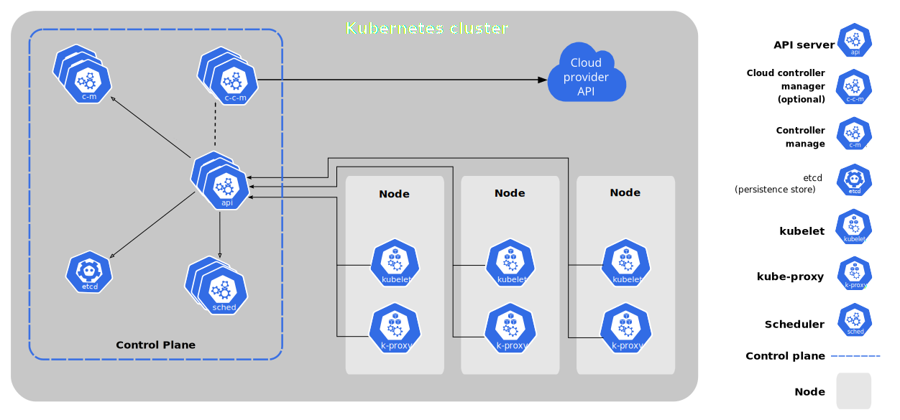

# Kubernetes for mineOps

Before this post begins, I would like to apologize for the long delay in getting this part of the series done. There were a few challenges in the way I was attempting to write this and life got in the way as well. But we are done with the Kubernetes portion of the series and I hope you enjoy it.

Since Containers were such a hit (and presented us with many challenges), the CEO has unleashed the new buzzword he heard (and says we need for some reason), Kubernetes. In Part 4 we took a long dive into Containers and how to do just about everything with them. In this part of the series, we will see how to make better use of Containers and handle some of the shortcomings of single node Container Hosts.

## What is Kubernetes?

Kubernetes is a collection of open-source software that handles the deployment and management of containers. This may or may not be a 1:1 copy of the info page of https://kubernetes.io, but it is honestly the best "simple" answer. Kubernetes is wildly complex beyond most peoples imaginations. For most people though, it doesn't have to be.

One of the many great things about Kubernetes is the scheduler, which handles the placement of applications on nodes in the Kubernetes cluster. How it does it is quite interesting and has some pretty deep engineering designs under the hood that I am quite literally not capable of explaining. So I'll just let Kelsey Hightower explain it in a simple elegant outline.

[](https://www.youtube.com/watch?v=HlAXp0-M6SY)

I've heard it said that Kubernetes is really just the "next Linux" and truth be told having been working with Kubernetes for quite some time now, I have to agree. Linux gave the data center its freedom to do many things and Kubernetes has now done this for the "Cloud" (and data centers). Many long time Linux admins and engineers will easily see the comparisons of Linux and Kubernetes

## Do We Need It?

As we go to talk with our CEO about Kubernetes and if we really need to go down this route, we are told: "don't ask silly questions, just implement this buzzword so we can keep up with all the new tech". Since it seems we have no choice lets dig in and find out what Kubernetes is going to be able to do for us that Containers couldn't on their own and try to find the benefits.

With Containers we had some interesting challenges around where to run containers and having to deploy them individually, which we could do with Ansible just fine already. Containers didn't really improve anything for us outside of learning a new technology. And that is because deploying and managing containerized applications is not an easy task, but thankfully that is quite literally what Kubernetes does and does it well.

If you watched the video above where Kelsey Hightower explained Kubernetes to folks at PuppetConf, you should have seen the concept of how Kubernetes schedules containers and frees up resources for "completed" workloads. With running Minecraft Servers, we typically wont see the latter part of that, but the former is really what we are looking for.

One of the biggest problems with running Containers, is just that, running them. Not from the perspective of docker run mycontainer, but running multiple workloads and managing multiple servers that run Docker/Podman and managing the Containers they have. This is something we didn't really touch on in the last article, but should have been obvious in the way in which we had to deploy Containers with Ansible (please note it would have been the same even if we had done it manually). Kubernetes at the end of the day is a scheduler, and the issue we had was scheduling our customer Containers at any form of scale. 

No time like the present, so lets dig in.

## Basics of Kubernetes

Just like Linux there are many "distributions" of Kubernetes and even a Linux from Scratch style approach. So what is a distribution of Kubernetes then? Since Kubernetes is grouping of software, there are specific groupings that can be had. Inside these groups of software remain some common and core components which we can dig into below.

Despite the complexity of Kubernetes and all the software that it makes up, for those who deploy applications on it or manage it, we can describe it quite easily. Just like when describing the "cloud", Kubernetes can be broken down into the 3 core pillars:

* Compute
* Storage
* Networking

Now how each of these is done can vary greatly, but each of these has a common item that can be used for each of them. Let's go over these a little:

#### Compute

In Kubernetes the smallest compute resource you can create is a Pod, which is comprised by a minimum of one Container. They are called Pods and not Containers because a group of whales is called a "pod" and if you noticed the logo for Docker is a whale. So there is some fun/silly trivia since when Kubernetes was created, Docker was really the only Container game in town at the time.

You can create Pods on their own or use other types of objects in Kubernetes to deploy and manage pods. We will be going into great detail here later, but just know the most common is called a Deployment.

#### Storage

Storage is always a fun concept as this is where our data is stored. It is even more interesting in Kubernetes as there are mechanisms to automatically provision storage for you depending on where you have Kubernetes installed and what you have installed on top of it. In the big 3 cloud providers, you get automatic provisioning of storage utilizing each of the big 3's "cloud storage" options.

There are other ways to utilize storage inside of Kubernetes. You can connect to NFS servers, use paths from the host, or even mount "files" directly into the Containers! And yes for the people running Windows file servers (or Samba for some reason), you can even use SMB/CIFS if you wanted to, just know that the node running Kubernetes will need a driver installed for SMB/CIFS.

#### Networking

For most SysAdmins and "DevOps" people alike, networking is the great equalizer (or the great headache depending on how you feel about it) when it comes to technologies. Kubernetes has some very complex networking going on under the hood, but unless you are trying to get into engineering or becoming a maintainer, we don't need to dig that deep. 

Cluster traffic is handled by objects called a Service. The core usage of a Service is "intra-cluster" communication, but depending on the environment can spin up Load Balancers external to the cluster allowing access to the compute resources behind the Service.

To get HTTP traffic into a cluster (so you can see your pretty web apps) you will need something called an IngressController. We will dive into Ingress Controllers later, but just know they are an additional item in Kubernetes that gets traffic into a cluster through an object called Ingress. 

There is also another method that is can be used called Gateways. This one is extremely important to many because it goes a step further than HTTP traffic by allowing us to ingress TCP traffic easily. There are other methods to ingress TCP traffic, but they are clumsy and cumbersome in comparison to Gateways.

Sadly however, we cannot get the full k8s Ingress experience with Minecraft Server as it uses its own version of the TCP protocol so even a Gateway cannot help us here. Thankfully there are still ways to run and use Minecraft on Kubernetes. Remember those cumbersome methods I just mentioned? Yeah thats us now.

### Not so basics of Kubernetes

For us, this section isn't entirely as important as understanding the basics of Kubernetes and how we can use it, but we will outline a lot of the components and how they really bring it all together.

The core of Kubernetes is the components that run in whats called the "Control Plane". This is aptly named as it controls all of the cluster and its components and sometimes items external to the cluster (depending what components are installed). A Control Plane node is a node in the cluster that runs one or more of the components that make up the control plane. Let's outline these components below:

#### Worker Node Components
* kubelet - The Kubernetes agent that runs on the node
* kube-proxy - Handles cluster network rules at the node level
* Container Runtime - We should remember this from Part 4 of this series

#### Control Plane Node Components
**NOTE** Control Plan nodes have all of the components of a Worker Node including:

* kube-apiserver - This is the front end of the Control Plane
* etcd - High performance key-value store that contains all cluster data
* kube-scheduler - Handles the scheduling of Pods on Nodes
* kube-controller-manager - Control loops that watch the state of the cluster

And here is a nice little visualization of the components from Kubernetes.

[](#)

### Building on top of Kubernetes

One of the great things about open-source software like Kubernetes is the ability to have customizations and distributions tuned to your liking. Out of the box, Kubernetes provides a pretty awesome platform to run containerized workloads, but does lack a few things that require other services outside of the cluster to fully function. Remember how we built out Minecraft Server image? Can't do that in a Kubernetes cluster out of the box and must use either your own Docker/Podman/Buildah instance to build these images. What about Security? Kubernetes has some basic security, but really doesn't provide any extensible security features outside of some very basic features.

OpenShift from Red Hat handles these shortcomings of a vanilla Kubernetes cluster by providing a much more complete Kubernetes package that you can deploy in all the major cloud providers or on-premise. If you are more of the DIY support group team, you can deploy OKD, the upstream project of OpenShift.

Here are just a few of the "add-ons" that OpenShift and OKD provide over a vanilla Kubernetes installation:

* Extensible security through SecurityContextConstraints utilizing SELinux
* A Container Build platform
* An internal Container Registry
* Cluster authentication built in (OIDC, LDAP and more)

### Getting access to a Kubernetes Cluster

A few years ago, getting access to a Kubernetes cluster was pretty much left to the big 3 cloud providers, but now we have many other methods and the ability to easily spin up our own cluster locally on our machine. For serving customers, we obviously aren't going to focus on any of the options for running a local cluster, so let's keep our focus to cloud providers. And now for the big players in the space:

#### Vanilla Kubernetes Clusters
* GKE - Google Kubernetes Engine
* EKS - Elastic Kubernetes Service
* AKS - Azure Kubernetes Service

#### OpenShift Platforms
* Amazon
* Azure
* IBM Cloud
* OpenShift Dedicated
* Self-Hosted

#### Self-Hosted, Smaller Cloud, Development
* DigitalOcean
* CRC
* Minikube
* Docker-Desktop

And now for the "Linux from Scratch" style Kubernetes cluster if you are so bold, https://github.com/kelseyhightower/kubernetes-the-hard-way. This repo is a project known as possibly the best deep dive DIY guide to Kubernetes to date. It is not for the faint of heart, but is truly an amazing guide to really building your own Kubernetes cluster.

There is even an upstream software called KubeVirt which lets you create Virtual Machines and treat them as Kubernetes Objects. Red Hat has a product that handles this through OpenShift and you can read more about that here. We will for sure not be diving into this during this series, but is something to keep in mind as we go throughout our DevOps journey.

## Using Kubernetes

When it comes to actually using Kubernetes, all you really need is the ability to authenticate with your cluster, usually through a kubeconfig and a client to connect with, typically kubectl. 

**Note:** The next few examples outline minikube as the nodes and not a cloud provider. All commands and demonstrations will be the same between Kubernetes clusters unless otherwise noted.

### Kubeconfig

Let's take a look at the kubeconfig our Cloud Provider gave us when the cluster was provisioned. This file should be placed in ~/.kube/config on your machine as kubectl by default will pick it up natively, or can be set through ENV vars (KUBECONFIG) or with the --kubeconfig flag for kubectl. I'm a big fan of not having to modify anything I don't have to, so mine goes into ~/.kube/config. Let's look at what it we have:

Depending on the Cloud Provider and how they grant access, the kubeconfig may look slightly different, but the core of each is the same. The breakdown of the sections is fairly straightforward:

```yaml
apiVersion: v1
clusters:
- cluster:
    certificate-authority: /minikube/ca.crt
    server: https://172.16.171.129:8443
  name: minikube
contexts:
- context:
    cluster: minikube
    namespace: default
    user: minikube
  name: minikube
current-context: minikube
kind: Config
preferences: {}
users:
- name: minikube
  user:
    client-certificate: /minikube/client.crt
    client-key: /minikube/client.key
```

* clusters - Lists the clusters and their information. certificate-authority, server and name are what commonly fit into these fields
* users - Outlines username a token or certificate belongs to
* contexts - This groups Kubernetes access data in an easy name. It combines data from the clusters and users sections to determine your "context" and is used to set the current-context which is where kubectl will talk with

### Getting kubectl

If your cluster was deployed in the cloud, chances are you will have a kubeconfig file prior to getting the kubectl binary, so let's go ahead and get the kubectl binary so we can actually communicate with Kubernetes.

For Mac users, you can install through a few different methods:

```sh
### Via Homebrew
$ brew install kubernetes-cli

### Direct from Kubernetes.io
$ curl -LO "https://dl.k8s.io/release/$(curl -L -s https://dl.k8s.io/release/stable.txt)/bin/darwin/amd64/kubectl"
```

Linux users can obtain it through curl as well and is the easiest method:

```sh
$ curl -LO "https://dl.k8s.io/release/$(curl -L -s https://dl.k8s.io/release/stable.txt)/bin/linux/amd64/kubectl"
```

And for other platforms and methods, you can always view the kubectl installation documentation at https://kubernetes.io/docs/tasks/tools/#kubectl.

#### First Commands with kubectl

So we have a `kubeconfig` file and `kubectl` installed, now its time to try to see what happens if we issue a command to Kubernetes. 

```sh
$ kubectl get nodes
NAME           STATUS   ROLES                  AGE   VERSION
minikube       Ready    control-plane,master   11m   v1.23.1
minikube-m02   Ready    worker                 11m   v1.23.1
minikube-m03   Ready    worker                 10m   v1.23.1
```

Well it looks like we've connected and got some data back, but lets break down the command we ran to get an idea of what is going on.

* get - this is one of the many commands or "verbs" for kubectl
* nodes - the target object of the get command

The output we received from Kubernetes tells us that it has 3 nodes, they are all "Ready" (the kubelet on each node is up and connected with the Kubernetes API), what their roles are (not entirely important for most users), how old they are and what version of Kubernetes they are running.

Some of the most common verbs you will use with kubectl are:

* get - Displays a resource (has many flag options)
* describe - Shows specific details about a resource(s)
* create - Creates a resource (or from a file with -f)
* apply - Applies a manifest
* delete - Deletes a resource (or from a file with -f)
* 
With some of the common verbs out of the way, lets see what all else we can find in the cluster.

```sh
$ kubectl get namespaces
NAME              STATUS   AGE
default           Active   25h
kube-node-lease   Active   25h
kube-public       Active   25h
kube-system       Active   25h

$ kubectl get all -n kube-system
NAME                                   READY   STATUS    RESTARTS   AGE
pod/coredns-64897985d-p7j5s            1/1     Running   0          25h
pod/etcd-minikube                      1/1     Running   0          25h
pod/kindnet-47kjw                      1/1     Running   0          25h
pod/kindnet-pknbj                      1/1     Running   0          25h
pod/kindnet-rdq4h                      1/1     Running   0          25h
pod/kube-apiserver-minikube            1/1     Running   0          25h
pod/kube-controller-manager-minikube   1/1     Running   0          25h
pod/kube-proxy-4pgbq                   1/1     Running   0          25h
pod/kube-proxy-n4ksg                   1/1     Running   0          25h
pod/kube-proxy-smjzx                   1/1     Running   0          25h
pod/kube-scheduler-minikube            1/1     Running   0          25h
pod/storage-provisioner                1/1     Running   0          25h

NAME               TYPE        CLUSTER-IP   EXTERNAL-IP   PORT(S)                  AGE
service/kube-dns   ClusterIP   10.96.0.10   <none>        53/UDP,53/TCP,9153/TCP   25h

NAME                        DESIRED   CURRENT   READY   UP-TO-DATE   AVAILABLE   NODE SELECTOR            AGE
daemonset.apps/kindnet      3         3         3       3            3           <none>                   25h
daemonset.apps/kube-proxy   3         3         3       3            3           kubernetes.io/os=linux   25h

NAME                      READY   UP-TO-DATE   AVAILABLE   AGE
deployment.apps/coredns   1/1     1            1           25h

NAME                                DESIRED   CURRENT   READY   AGE
replicaset.apps/coredns-64897985d   1         1         1       25h
```

The first command above looked for something called a namespace which is a Kubernetes object that groups resources. In a normal Kubernetes cluster a namespace could contain a single application, a teams applications, a customer's applications or any number of combinations and doesn't really matter. The only thing to note about namespaces is that the objects in a namespace are "sectioned" off in that namespace and cannot be accessed by other objects in other namespaces except where explicitly granted via RBAC or some other mechanism (more on this later).

For the second command kubectl get all -n kube-system, the -n flag specifies to run the command against the namespace, kube-system (we can see that is a valid namespace from the first command). With the get command, you can specify what you want specifically (such as with get namespaces) or you can specify all which returns "most" objects in a namespace. When I say most, I do not mean that it will only return some of the objects, what I mean is that Kubernetes and kubectl have a specific set of objects in the namespace it displays. There are other objects that can be "within" a namespace that can be viewed by calling them out specifically via the get command. The focus of get all revolves around mostly the pods, what manages those pods (such as Deployments, ReplicaSets and DaemonSets) and Services.

If you are ever curious about all the namespace level objects and want to actually get all of them, here is a handy kubectl command you can run, but be warned, this really does get every single object that exists in a namespace.

```sh
# Put this in your .bashrc or .bash_profile
# Function is run like this: kubegetall NAMESPACENAME

kubegetall () {
for i in $(kubectl api-resources --verbs=list --namespaced -o name | grep -v "events" | sort | uniq); do
  echo "Resource:" $i
  kubectl -n ${1} get --ignore-not-found ${i}
  echo ""
done
}
```

For an example of the output of the above command, check out this GitHub Gist. And note the output in that Gist is on a minikube cluster with practically no additional Kubernetes addons (again, more on this later). Hardly any of those outputs in a namespace are needed for normal cluster/namespace operation, but do come into play occasionally. You will most typically get the specific object you need as opposed to getting everything.

The commands above, excluding the kubegetall function, are the most common that you will use, but we need to start diving a little deeper into Kubernetes objects and some more verbose commands.

### Kubernetes Objects

All Kubernetes objects can be viewed much like our kubeconfig was and in different ways. Let's take a look at one object, the kubernetes Service in the default namespace. 

**NOTE:** Just a quick discussion, default is just what it sounds like. If there is no context set, kubectl will always target the default namespace. It is not best practice to put your applications here, but there are many guides out in the Internet that "teach" you to just put your applications here. Please do not do this and utilize namespaces as they are there to save you. If you feel like blowing away your namespace with a kubectl delete all, well that will also delete the kubernetes Service which could have less than desirable side effects.

```yaml
$ kubectl get svc kubernetes -o yaml
apiVersion: v1
kind: Service
metadata:
  creationTimestamp: "2022-01-26T03:48:38Z"
  labels:
    component: apiserver
    provider: kubernetes
  name: kubernetes
  namespace: default
  resourceVersion: "207"
  uid: 91e5f024-5267-4210-a595-3f6368db0c0b
spec:
  clusterIP: 10.96.0.1
  clusterIPs:
  - 10.96.0.1
  internalTrafficPolicy: Cluster
  ipFamilies:
  - IPv4
  ipFamilyPolicy: SingleStack
  ports:
  - name: https
    port: 443
    protocol: TCP
    targetPort: 8443
  sessionAffinity: None
  type: ClusterIP
status:
  loadBalancer: {}
```

The command above was a normal kubectl get command, but we've added a new flag, -o. More info on the -o flag will be next. All of the information above is broken down into a few "core" fields that are common with almost every single Kubernetes object. Let's break down the "core" fields here to get a better understanding:

* `apiVersion` - Specifies which `apiVersion` the object is requesting/using from the Kubernetes Controller(s)
* `kind` - This identifies what an object is and also identifies what the `get` command would look for
* `metadata` - There are many sub fields in here, but the most common to be aware of are:
    * `name` - the actual name of the object
    * `namespace` - where the object "lives" (cluster level objects do not have a `namespace` attribute)
    * `labels` - key/value labels for adding attributes to an object
    * `annotations` - similar to labels, but are typically used by Operators and additional Kubernetes Controllers that "watch" for objects with specific annotations
* `spec` - The `spec` are is where the real identify of the object comes from. This section is where most Kubernetes objects differ from each other as each object has its own unique specification. Just know that the fields contained within the `spec` section are what makes up the configuration of an object
* `status` - Status is not something you can "apply" to an object as this field is managed by Kubernetes itself and will be updated live with various attributes depending on the Kubernetes Object. Examples would include a Deployment `status` of `availableReplicas`, `conditions` which shows the last time an object was modified/updated. 

With that massive wall of text out of the way, the rest of the Kubernetes objects you deal with will ultimately be the same except for the spec field. Knowing these "core" fields will make looking at and creating Kubernetes manifests much easier. If you ever find yourself unsure of an object or the fields it can contain, kubectl has an amazing built-in function called explain which does just as it sounds. I will not put an example in the blog here, but I will post a GitHub Gist you can review. Just know that each object follows the format of a json style path: object.spec.configitem1.configitem2

Now for some more information regarding the -o flag from above. The -o flag stands for output and here are some of the common options you will most likely use:

* `-o yaml` - Prints out the YAML of a Kubernetes object(s)
* `-o json` - Same as above, but in JSON format (best when piped to jq imo)
* `-o name` - Prints the object(s) without any other data except type/name such as pod/etcd-minikube
* `-o wide` - Prints out similar to with no -o flag but provides more details in line. For pods this includes the node they are running on
* `-o jsonpath` - A little more advanced, but can be used to get specific fields from an objects manifest. Example: kubectl get pod etcd-minikube -o jsonpath='{.spec.containers[].image}' will return the image: line of the manifest. This can be done with get -o yaml | grep, but is much cleaner 

So we've looked at kubectl get and added the -o flag, but there is another command that gives more or less the same data, but in a different format and that is kubectl describe. This command gives all the usual manifest data from kubectl get -o yaml, but formats it differently and provides us with a new item to look at called events:

```sh
$ kubectl describe svc kubernetes
Name:              kubernetes
Namespace:         default
Labels:            component=apiserver
                   provider=kubernetes
Annotations:       <none>
Selector:          <none>
Type:              ClusterIP
IP Family Policy:  SingleStack
IP Families:       IPv4
IP:                10.96.0.1
IPs:               10.96.0.1
Port:              https  443/TCP
TargetPort:        8443/TCP
Endpoints:         172.16.171.129:8443
Session Affinity:  None
Events:            <none>
```

As you can see if you were to compare the above output to the kubectl get svc kubernetes -o yaml you would see we haven't really "gained" any data except a new field called Events which shows the events an object has. For a Service, there probably won't ever be many (except in possible some bad scenarios), but for a Pod, this will show the Pod being scheduled, NIC assignment, pulling the image for the containers to run and starting each of the containers. The events are very useful for troubleshooting, but you do not need to see them via kubectl describe as they are an object you can also just kubectl get events. One other item to note on describe vs get is the labels section. If you compare the two outputs, you will notice that describe gives us labels with a key=value as opposed to a key:value.

Which brings me to the next example regarding Kubernetes Objects and that are selecting objects based on their labels. This next example is really more beneficial in namespaces with many applications living in it, but the core of what it does can be seen here. Since we saw that some objects have labels, lets use a label (that we would have either known about or obtained via describe or get) and use it as a selector via another flag -l:

```sh
$ kubectl get all -n kube-system -l k8s-app=kube-dns
NAME                          READY   STATUS    RESTARTS   AGE
pod/coredns-64897985d-p7j5s   1/1     Running   0          3d10h

NAME               TYPE        CLUSTER-IP   EXTERNAL-IP   PORT(S)                  AGE
service/kube-dns   ClusterIP   10.96.0.10   <none>        53/UDP,53/TCP,9153/TCP   3d10h

NAME                      READY   UP-TO-DATE   AVAILABLE   AGE
deployment.apps/coredns   1/1     1            1           3d10h

NAME                                DESIRED   CURRENT   READY   AGE
replicaset.apps/coredns-64897985d   1         1         1       3d10h
```

With -l being a selector, we chose k8s-app as our label with the value of kube-dns. This shows all objects that share this label and help us identify all the components that make up the kube-dns application. This will be extremely handy to remember when working with Kubernetes and multiple applications as it allows you to grab just the objects that share the label. This can also be run with the get all -A instead of the -n namespace-name flag and will append the namespace of each object before the object:

```sh
$ kubectl get all -A -l k8s-app=kube-dns
NAMESPACE     NAME                          
kube-system   pod/coredns-64897985d-p7j5s 

NAMESPACE     NAME              
kube-system   service/kube-dns 

NAMESPACE     NAME                     
kube-system   deployment.apps/coredns 

NAMESPACE     NAME
kube-system   replicaset.apps/coredns-64897985d
```

**NOTE:** On the above command I removed all data after the NAME field for readability, but it prints out the same as the prior command. You can even chain other flags onto the selector such as -o wide or -o yaml, but note the -o yaml will print all of those objects into a List which is typically unpleasant to scroll through, so I would recommend piping that to a file to review.

### Where do objects live?

So we have looked at Kubernetes Objects and how to get and describe them, but we haven't really discussed "where" they live. Now so far every single object has been a namespace level object, but there are objects in a Kubernetes cluster that are not at a namespace level and live at the cluster level. These objects have a flag in their definitions which state namespaced: false. For a list of Kubernetes objects in your cluster which can be created/applied you can run the kubectl api-resources --verbs=list command to identify them. You can also separate them into namespaced=true or namespaced=false to show which objects are for which area of a cluster.

[](#)

As you can see there are quite a few objects that can be created in a namespace, but hardly any of these will be used by most people directly, but each of them have their place and provide great value as you grow in your Kubernetes knowledge and administrative capabilities. Thankfully this output shows you the apiVersion and kind of the objects to help you identify and create your own if you are having issues.

#### Cluster Level Objects

Now lets dig into the non-namespaced level objects commonly known as cluster-level objects. Depending on the cluster there may be less or more of these, but the common ones are here:

[](#)

As you can see in the output above its no different than the namespace level objects with the exception of the NAMESPACED field being false. Whichever cluster you are working with, you can use the kubectl api-resources command to identify which objects the cluster can have. This really comes handy in debugging as you get into more advanced Kubernetes objects, which in fairness most of the complexity comes from the Networking components as they can vary greatly depending on what has been installed on the cluster.

The more common cluster level objects that you really need to know about are, nodes, clusterroles, clusterrolebindings, and potentially ingressclasses. Nodes are important just to know the state of the cluster, clusterroles and clusterrolebindings are for managing RBAC in the cluster.

There really isn't much more to discuss about objects in the context of describing them. It is now time to start looking at some of the objects we will need to use and be aware of for deploying applications.

### Deploying an Application

So we know about Kubernetes objects and how to look at their specifications to determine what they are and do, but we haven't seen anything outside of what Kubernetes itself needs. Just like in the Docker part of this series, we did a basic "hello-world" which actually provided some value as it outlined quite a few unique attributes of containers. There is not an equivalent in Kubernetes, but thankfully we don't really need one. As mentioned before, Kubernetes can easily be broken down into the 3 main components of a "cloud" (Compute, Storage, Networking), so let's look at manifests that generate those components. All manifests can be found here in the support GitHub repo for MineOps.

Instead of diving straight into a Minecraft Server deployment, we will look at a VS Code Server to get a feel for more Kubernetes components. Typically you would name your manifest files after what they are, but for the sake of comparing the 3 main components, I've named them after what they "do".

#### Compute Manifest

Inside of the [compute.yaml](../../files/Kubernetes/basic-application/compute.yaml) file we have a single object which is our Deployment. A Deployment is responsible for, well, deploying a Pod which can have any number of Containers in it. This particular example only has one Container which uses the image for a VS Code server that can run in a browser. This image is hosted in Quay.io and when the Pod goes to spin up, the kubelet on the node where the Pod has been scheduled will basically run a docker pull to get the image so it can then start the Container. A few items of note in this manifest, are the volumeMounts, volumes, and env sections.

* env - This provides environment variables to the Container and in our case passes in a PASSWORD to login to the VS Code Server
* volumes - Volumes outline which objects are required to "mount" to a Pod. This can be a persistentVolumeClaim (which we will be using and discussing), ConfigMap, NFS share, iSCSI volumes, Secrets and quite literally anything. Note that volumes are declared at the Pod level and not the Containers
* volumeMounts - Identifies where a volume should be mounted inside a container. Depending on the type of volume used, if you were to run df inside the Container, you may see it as a literal mount like any other mount would be

#### Storage Manifest

Our storage manifest is quite simple as you can see in [storage.yaml](../../files/Kubernetes/basic-application/storage.yaml). There is a single object called a PersistentVolumeClaim which will, based on its spec, request 5Gi of storage. Now the "how" it does this is unique for each platform, but a PersistentVolumeClaim will request a PersistentVolume from the cluster of the same size as the requested Claim and if one does not exist will look to the StorageClass to create one. A StorageClass is a provisioner that resides in a cluster to reach out to a storage platform and create a share/volume/disk which is then present in the cluster as a PersistentVolume. A cluster can have more than one StorageClass and one of these can be set to the default which will be where all PersistentVolumes are created from, unless in the PersistentVolumeClaim you specify the storageClass to use. Now if there is no StorageClass in a cluster, you will have a PersistentVolumeClaim perpetually stuck in a Pending state. 

Most if not all clusters deployed in the cloud will always have a StorageClass, but there will be specific use-cases where you may want a different type of underlying storage. Sometimes you may be running a database which may not like being on Amazon S3 File storage and would be better suited performance wise with block storage. These choices will change depending on the application and the team running it and whatever architectural and platform decisions are made. 

There are some storage platforms that do some "interesting" things as it relates to mounting the share/volume/disk to the running Pod. Some workarounds may have to be made to your application, or your deployment (which we will go into later) to have the storage work as expected. This is not the case with all storage platforms, but some do have permissions that make life interesting.

#### Network Manifest

The [networking.yaml](../../files/Kubernetes/basic-application/networking.yaml) file has 2 objects inside of it, a Service and an Ingress. This manifest is broken up by the YAML syntax of --- which creates a "break" and tells the renderer (in our case kubectl) where the next object begins. 

<br>

This is one of a few ways to use a single file to house multiple objects, the other being an actual List. Here is a quick snippet of a List:

```yaml
apiVersion: v1
kind: List
items:
- apiVersion: v1
  kind: Service
  ~~~~~
- apiVersion: networking.k8s.io/v1
  kind: Ingress
  ~~~~~
```

There are times depending on the client using the manifest where a List may be helpful, but for now its just another little bit of information and using the --- to break up objects works fine.

<br>

We explained earlier that a Service is for the most part meant for "in cluster" communication. A Kubernetes Service can actually have many different forms and how the work depends on the underlying platform they run on (see why some people say Kubernetes is hard/confusing?). The Service can have a few different types each doing something different with the most commonly used (and "default" type) being the ClusterIP. A Service with a ClusterIP basically gets a non-routable IP address (well, its routable, just only in the cluster) and is used as a front end for other services/applications in the cluster to be able to resolve the Service. Each Service, regardless of type, gets a DNS name in the cluster. For our example Service in the networking.yaml file the cluster DNS name would be: code-server.code-server.svc.cluster.local or even code-server.code-server. This comes in quite handy when building out multiple applications as you don't really have to worry about DNS, just your Service names and namespaces.

Even though we didn't cover this in the Containers part of this series, you will eventually run across someone using docker-compose or just docker and something called link and/or bridges. What that accomplishes is allowing Containers to "know" about each other and be able to communicate. A Kubernetes Service, which gets a DNS entry the entire cluster can use by default, your applications can find other applications via their Service name without any real changes or worrying about hostnames and DNS. Since networking is a pretty huge part of most applications, lets dig into this concept just a little further, even though our Minecraft Server wont really be utilizing this, it is extremely important to understand for working with Kubernetes.

<br>

Let's take a basic application as an example such as Wordpress. Wordpress has a web front end in PHP and needs a database as its backend (typically MySQL). In a normal installation on a VM or something similar, you have to give Wordpress the DNS name or IP of the database for it to be able to connect to. Depending on how and where you deploy Wordpress this could change drastically and be something you have to "hunt down" every single time you deploy a new Wordpress instance. In the Kubernetes world, your database will almost always have a Service regardless of any other factors making it simple and easy to deploy multiple Wordpress instances across a Kubernetes cluster.

<br>

Now for the important and "complicated" topic of Ingress. Ingress is an object created in a Kubernetes cluster that allows traffic into the cluster from outside of the cluster. Services do not do this, but technically can enable external traffic into the cluster, but in a very different way. Services that are of the type: LoadBalancer and on a supported platform, creates a Load Balancer on the platform with a Public IP Address that then connects it to the Service. This can work for some use-cases, but is very much a one to one of IP<->Service. Using Ingress allows for far fewer external IPs (in theory only 1 for most) and allows you to use DNS names to route traffic into the cluster. The IngressController will then pass the traffic to the Services based on the host defined in the rules section.

Quick example to highlight this and how it works:

You have an IngressController with an external Load Balancer with an IP of 20.192.1.254, you create an external DNS record of *.kube.example.com which resolves to the IP of 20.192.1.254. Inside of your cluster you can create an Ingress object that has a configuration like so:

```yaml
~~~
spec:
  rules:
  - host: "code.kube.example.com"
~~~
```

The above snippet should more or less outline what this is going to do, but basically the Ingress object allows the IngressController to do this:

* Listen for traffic coming in over the DNS/IP of 20.192.1.254
* Check rules for existing Ingress objects
* Route external traffic into the cluster to the Service with the matching rules for the host rule in the Ingress object
* Service then passes traffic to the pod(s) matching its labels

<br>

That was a rough outline of what Ingress is and does, but there can be multiple IngressControllers that allow for different features and your Ingress objects can specify which one to use via an annotation. For us we will not be using Ingress, but there are other ways to do this which we do not need to go into here, but it is important to know the common ways to get traffic into your cluster.

#### Applying the Manifests

So now that we did a semi-deep dive on the manifests and what they are going to do, lets go ahead and try to create them and see where we can get. There are a few ways to do this, but the easiest way to apply multiple manifests is to have them in a directory and target that directory with kubectl using the -f flag which specifies a "filename". This filename can be a file, directory or even a URL (which is handy if you have a manifest on the Internet somewhere and wish to use it without having it locally). You can apply multiple manifests, but only through targeting a directory (sadly you cannot apply multiple individual files).


[](#)

[](#)

So we applied our manifests and now have a working application in our Kubernetes cluster as seen by going to code.kube.example.com. Nothing is really too special about this except that we have a running application. Its just VS Code  in a browser (a really cool project) running in a container. Now if we look at a few things we can see what all we created in these manifests:

```sh
$ kubectl get all
NAME                               READY   STATUS    RESTARTS   AGE
pod/code-server-7c444dc854-9bfcw   1/1     Running   0          12h

NAME                  TYPE        CLUSTER-IP       EXTERNAL-IP   PORT(S)    AGE
service/code-server   ClusterIP   10.102.116.112   <none>        8080/TCP   12h
service/kubernetes    ClusterIP   10.96.0.1        <none>        443/TCP    41h

NAME                          READY   UP-TO-DATE   AVAILABLE   AGE
deployment.apps/code-server   1/1     1            1           12h

NAME                                     DESIRED   CURRENT   READY   AGE
replicaset.apps/code-server-7c444dc854   1         1         1       12h


$ kubectl get ingress
NAME          CLASS    HOSTS                   ADDRESS          PORTS     AGE
code-server   <none>   code.kube.example.com   172.16.171.146   80, 443   12h

$ kubectl get pvc
NAME          STATUS   VOLUME                                     CAPACITY   ACCESS MODES   STORAGECLASS   AGE
code-server   Bound    pvc-e443ccf4-6bcf-47cd-a998-88d007eed995   5Gi        RWO            standard       12h
```

In the compute.yaml manifest we had a Deployment, but we now also see a replicaset and a pod. Without going into a super deep dive, a Deployment is more of a "specification" of how pod(s) should be created and managed. A Deployment will generate a ReplicaSet with the specification and it's the ReplicaSets job to manage the state of the Pod. If the pod is deleted, the ReplicaSet will request a new one be created. Nearly all "compute" resources in Kubernetes follow this model to a degree. And to add fun to that, the pod we ultimately got has 1 Container in it. A pod can have multiple containers as we mentioned earlier in this blog.

```sh
NAME                               READY   STATUS    RESTARTS   AGE
pod/code-server-7c444dc854-9bfcw   1/1     Running   0          12h
```

The rest of the objects are all there and we can see details about them (which should match what we have in the manifests we applied). For the most of our use-case, this is just about all we really need to know about Kubernetes manifests and applying them as everything else you will ever deploy in a Kubernetes cluster follows basically the same logic.

### Minecraft on Kubernetes

Now that we've gotten a somewhat decent outline of what Kubernetes is and what it looks like to deploy an application, its now time to actually deploy Minecraft Server on Kubernetes.

#### Building our Manifests

As with our example deployment of the VS Code Server above, we will need manifests to create and deploy our Minecraft Server, but instead of creating these objects in the default namespace, we will create them in a namespace dedicated to our application. We can have many Minecraft Servers per namespace or one per. Since we our now moving to putting Minecraft Server for our customers in Kubernetes, we will be using a namespace per customer to logically break up the applications (and more easily identify what goes where). So lets create our first namespace prior to deploying these manifests.

```sh
$ kubectl create namespace mineops-0
namespace/mineops-0 created
$ kubectl config set-context --current --namespace mineops-0
Context "minikube" modified.
```

We also ran another command and that was to set our current context to allow any manifest we apply to go into that namespace. The previous statement is true unless the manifest you apply has its metadata set to specify a namespace like this:

```sh
metadata:
  namespace: someothernamespace
```

The above snippet for whatever is in it will be applied only to the namespace someothernamespace regardless of the context of your kubeconfig. For our manifests we will be omitting this (to be explained later) so we will need to ensure we change our context as we did above.

#### Service (Networking)

Now for the best part, but also the "worst" part about this whole endeavor. There is nothing stopping us from running Minecraft Server on Kubernetes, however there is one issue I outlined earlier that we will run into. Since Minecraft uses its own version of the TCP Protocol, we are unable to use any typical Ingress or Gateway method to route traffic to a specific Container. We are going to have to do essentially what we did during all previous iterations of deploying Minecraft Server for our customers and that is 1 Server per IP. Sadly there is no known way around this (much of the reason this article took so long to come out was trying to engineer a way around it). So lets get on with what we can do and go from there. Here is what our Manifest will be and keep in mind this assumes that our Kubernetes cluster is running on a platform/provider that can provision IPs via a Load Balancer service:

```yaml
apiVersion: v1
kind: Service
metadata:
  labels:
    app: mineops
  name: mineops
spec:
  ports:
  - port: 25565
    name: tcp-minecraft
    protocol: TCP
    targetPort: 25565
  selector:
    app: mineops
  sessionAffinity: None
  type: LoadBalancer
```

The above Service will act as a normal service except that because its type is LoadBalancer it will trigger the underlying platform to provision an IP address and "map" it to this Service as we will see in a moment. There is not much else to cover here for the networking portion so lets move on to storage.

#### PersistentVolume (Storage)

For nearly all Kubernetes clusters, you are going to have some dynamic storage provisioner in the cluster and can be verified by checking for a storageclass like so:

```sh
$ kubectl get storageclass
NAME                 PROVISIONER                RECLAIMPOLICY   VOLUMEBINDINGMODE   ALLOWVOLUMEEXPANSION   AGE
standard (default)   k8s.io/minikube-hostpath   Delete          Immediate           false                  6d5h
```

Depending on the cluster and where it lives, the name and provisioner fields will most likely have different data inside of them, but for the most part they will all function the same. Similar to our previous "storage" manifest we will just be creating a PersistentVolumeClaim which will check to see if there is a volume matching our request and if not, go create one (using whatever provisioner is default or selected).

```yaml
apiVersion: v1
kind: PersistentVolumeClaim
metadata:
  name: mineops
spec:
  accessModes:
    - ReadWriteOnce
  resources:
    requests:
      storage: 5Gi
```

Nearly all storage providers will be able to work fine for our scenarios, but there are some providers that work far better than others. Block level storage will grant us the best speeds for I/O of the Minecraft Server and is what we should look to use. If the platform we deploy to has the option of choosing a StorageClass and one of them is block, go for that one (which is what we will do). The StorageClass can be specified in the PersistentVolumeClaim manifest by adding this line to it:

```yaml
spec:
  storageClassName: standard
```

Block storage is amazing with its I/O capability, but there are some minor things we need to work around prior to it working as some storage providers do. We will go over and discuss this in the next section.

#### Deployment (Compute)

All workloads on Kubernetes come from somewhere and no different than the VS Code Server example was used previously, we will be using a Deployment. The manifest will look something like this:

```yaml
---
apiVersion: apps/v1
kind: Deployment
metadata:
  labels:
    app: mineops
  name: mineops
spec:
  selector:
    matchLabels:
      app: mineops
  replicas: 1
  strategy:
    type: Recreate
  template:
    metadata:
      labels:
        app: mineops
    spec:
      containers:
      - image: docker.io/mineops/minecraft-server:prod
        imagePullPolicy: Always
        name: minecraft-server
        ports:
        - name: minecraft
          containerPort: 25565
          protocol: TCP
        volumeMounts:
        - mountPath: /minecraft
          name: minecraft-data
        - mountPath: /minecraft/server.properties
          subPath: server.properties
          name: server-properties
      volumes:
      - name: minecraft-data
        persistentVolumeClaim:
          claimName: mineops
      - name: server-properties
        configMap:
          name: minecraft-server
```

For most platforms this will be just fine and work as intended, however for us using block storage for that sweet read/write performance, we are going to run into something else that needs to be added to the Deployment. It is a new concept called an initContainer, which just as its name sounds will be run on "initialization" of the Pod. initContainers can be extremely powerful, but just know they are not a "one and done". Every time a Pod starts up that has an initContainer, the initContainer will run. So if you have in the future an idea for an initContainer to handle some "pre Pod work", just know that it will run every single time the Pod is spun up. 

##### initContainer

As mentioned earlier when discussing the manifests, some storage platforms have small challenges to overcome. For both the built-in storageClass of Minikube and many cloud provider default block storage class, we must implement a workaround for our Minecraft Server deployment. The issue with these block storage providers is that they mount the volume as root and our Container does not run as root because that is a very bad security practice. If we use the default storageClass of each of these providers, we will run into a permission denied issue when attempting to write to the PersistentVolume. Our workaround will involve an initContainer which we are going to use to "fix" our permissions prior to starting the main Minecraft Server Container. It follows many of the same spec outlines of our normal Pod as we can see here:

```yaml
      initContainers:
      - name: data-permission-fix
        image: busybox
        command: ["/bin/chmod","-R","777", "/minecraft"]
        volumeMounts:
        - name: minecraft-data
          mountPath: /minecraft
```

The above code will go into our Deployment at the same "level" in the spec as the containers field. We could technically implement something like this into a startup-script called by the ENTRYPOINT of our Dockerfile, but there is no real need to do this, when its only needed on some platforms.

#### "Ingress" for Minecraft

As I mentioned in the description of the Service manifest above, Ingress will have to be handled as a 1 IP to 1 Minecraft Server. In almost all other Kubernetes Ingress related scenarios this is not the case regardless of application type. Nothing wrong here, but ideally you would want to reduce the number of IPs for your services and be able to have your Ingress Controller or ServiceMesh be able to Ingress traffic and route it for you.

#### Getting Configuration data into a Pod

Since we have yet to discuss ConfigMaps lets do that now. ConfigMaps can be used to store data in a "key:value" style specification. How you use them is up to you, but for us we will be using ConfigMaps to store our server.properties configuration file. This will be a somewhat different change from our Containers part of this series, where we had a local directory on a server with a server.properties that we pushed out via Ansible and maintained in Git.

If you noticed in the Deployment manifest above, we are mounting a ConfigMap as a volume for our Pod, but how do we get one and whats in it? We can create configMaps as any other object by having a manifest to create it with, or we can do something pretty neat and that is having kubectl "ingest" a file as its manifest as we can see below:

```sh
$ kubectl create configmap minecraft-config --from-file=server.properties
configmap/minecraft-config created
```

And if we were to look at our ConfigMaps via kubectl get -o yaml we would see that we have something that looks like this (some lines omitted for readability):

```yaml
$ kubectl get cm -o yaml minecraft-config
apiVersion: v1
data:
  server.properties: |
    debug=true
    enable-jmx-monitoring=false
    rcon.port=25575
    gamemode=survival
    enable-command-block=false
    ~~~OMITTED~~~
kind: ConfigMap
metadata:
  name: minecraft-server
  namespace: mineops
```

One thing to note is the field above data is something new and can basically be viewed as the spec for certain types of objects with ConfigMaps and Secrets being some of the main ones. Everything will boil down to a key and a value regardless of the size of the value. Since we didn't go over many items for ConfigMaps here are a few examples (excluding what we see in the above snippet).

```yaml
data:
  somevar: 42
  
  myscript.sh: |
    #!/bin/bash
    echo "hi"
```

**NOTE:** Although we didn't go into Secrets in this series, Kubernetes Secrets play a big role in storage sensitive data in a Kubernetes cluster and follow the same key:value model as ConfigMaps with one exception, the values inside must be base64 encoded and have no trailing newlines. More information on Secrets can be found [here](https://kubernetes.io/docs/concepts/configuration/secret/).

### Deploying Minecraft Server

Now that we have all of our manifests its time to deploy our manifests into our cluster. Just as with every other manifest we can just run kubectl apply or kubectl create to get our manifests into the cluster. So here we go!

[](#)

Looks like we've got everything created in our namespace and the Minecraft Server Pod seems to be up and running. Before we connect lets dig a little deeper and see whats going on with our Pod just for some more context and a bit more visibility using Kubernetes. We will watch the logs as we connect using kubectl since we aren't on a VM and don't have normal access to the local log file.

#### Connecting to our Minecraft Server

So now comes the best time of our deployment and that is to see if it works as we anticipate. We will have kubectl logs -f PODNAME running alongside so we can see the status of the Minecraft Server as well as verifying that we've connected.

[](#)

Whelp, looks like that is another one down in the history books. We've officially done what our CEO has asked of us and deployed our Minecraft Server to Kubernetes. How do migrate our customer's existing data to Kubernetes from our existing Container infrastructure? In the next and final section of this post we will look at some of the extra things that never get talked about in a real world Kubernetes scenario.

## Migrating to Kubernetes

Since we don't have direct access (at least over normal methods such as SSH) to the nodes in Kubernetes and our Minecraft Server data will live in a PersistentVolumeClaim from a storage provider, how do we get data into this PVC? As with most things, there are many methods and some may be cleaner than others. For us, we are going to open a simple HTTP Server that will serve the Minecraft Backup's we are taking (we do take backups right?). With that open, we will be able to retrieve the backup tarball from a Container using curl, extract it and then go stand up our Minecraft Server.

### Exposing our backups

The method in which we are going to do this may be frowned upon by some, but since it is just a Minecraft Server backup and no company intellectual property, it isn't really that big of a deal. For more sensitive data that would be migrated, we would come up with a more elegant solution that involves either HTTPS or SSH with keys of some kind (or even an Amazon S3 bucket through [Minio)](https://min.io/).

Thankfully Python has an extremely simple HTTP server that can be stood up and accessed easily. From wherever we are hosting our backups, we would go into the directory where backups are stored and then run the following (for Python 2.X the command would be: `-m SimpleHTTPServer`).

```sh
$ python -m http.server
Serving HTTP on :: port 8000 (http://[::]:8000/) ...
```

With that up, we can now use curl to grab our Minecraft Server backups, but we will need a Container in our cluster to do this. I've [created a new set of manifests](../../files/Kubernetes/mineops-customer-manifests) for deploying customer Minecraft Servers in a Kubernetes cluster. There are 2 manifests, a customer-init and a customer-run.  The customer-init manifest will deploy a Pod that we can then use kubectl exec -it customer-init -- bash to get into an interactive terminal to the Pod and then run our curl and tar commands. If we were mass migrating customers, we would do something a little different, such as have a Pod for each customer that would run a script to curl the backup and then extract it for us as we spin up each namespace (and we might do this in the next part of the series). For showing a "one off", this will do, but we will need to ensure when we do this, we have a clean environment, so we will start with a fresh namespace that has no running Minecraft Server (as if we were migrating a customer initially). We will have the PVC get created along with our Pod to be able to ensure a PVC is created in our namespace to be able to get data into it.

```sh
$ kubectl create namespace mineops-0 && kubectl create -f customer-init.yaml -n mineops-0
namespace/mineops-0 created
persistentvolumeclaim/mineops created
pod/customer-init created
$ kubectl exec -it -n mineops-0 customer-init -- bash
[root@customer-init /]# cd /mineops-data
[root@customer-init mineops-data]# curl -sL -o mineopsbackup.tgz http://somefileshare.com/backups/customer-0-server-1.tgz
[root@customer-init mineops-data]# tar -xf mineopsbackup.tgz
[root@customer-init mineops-data]# exit
$ kubectl delete pod -n mineops-0 customer-init
pod "customer-init" deleted
```

We have now manually obtained our one customer backup and extracted it into the PVC in their namespace (mineops-0). The only thing left to do is create the rest of the objects so the Minecraft Server can spin up and the customer can start playing. Once the objects have applied and we get the Public IP for the Service, DNS can be updated to target that Load Balancer.

```sh
$ kubectl create -f customer-run.yaml -n mineops-0
configmap/minecraft-server created
deployment.apps/mineops created
service/mineops created
$ kubectl get svc -n mineops-0 mineops
NAME              TYPE           CLUSTER-IP       EXTERNAL-IP      PORT(S)           AGE
service/mineops   LoadBalancer   10.245.225.155   143.244.222.81   25565:31568/TCP   9h
```

The pod should be up and running and checking the logs should show that:

```sh
$ kubectl logs -n mineops-0 mineops-64d95d95f4-kbpqf
[20:58:27] [Worker-Main-2/INFO]: Preparing spawn area: 42%
[20:58:27] [Worker-Main-2/INFO]: Preparing spawn area: 42%
[20:58:27] [Worker-Main-2/INFO]: Preparing spawn area: 42%
[20:58:27] [Server thread/INFO]: Time elapsed: 65986 ms
[20:58:27] [Server thread/INFO]: Done (66.234s)! For help, type "help"
[20:59:16] [Server thread/WARN]: handleDisconnection() called twice
[21:24:58] [Server thread/WARN]: handleDisconnection() called twice
[22:04:00] [User Authenticator #1/INFO]: UUID of player Hardcoreqq is fc138322-655d-4534-b351-7cb178e7c3da
[22:04:00] [Server thread/INFO]: Hardcoreqq[/10.108.0.3:35082] logged in with entity id 80 at (163.5, 67.0, 238.5)
[22:04:00] [Server thread/INFO]: Hardcoreqq joined the game
[22:04:06] [Server thread/INFO]: Hardcoreqq lost connection: Disconnected
[22:04:06] [Server thread/INFO]: Hardcoreqq left the game
```

## Wrapping Up

We've covered just about everything we need to know for using Kubernetes to deploy workloads (mainly Minecraft Server instances) for our customers and how to migrate them from somewhere else. There are many other topics in the Kubernetes world, but as long as you remember that each of them boils down to one of the big 3 (compute, networking and storage), it will make your lives all that much easier. 

There are other areas that do relate to deploying Minecraft Servers on Kubernetes that we did not go into too much depth such as managing multiple namespaces for customers, but we will be discussing that in greater detail in the next and final part of this series. And remember whenever you have manifests or configuration files, always put it in Git!
