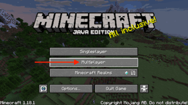

# Minecraft Server

Minecraft Server is run with Java. There are numerous ways to accomplish this, but the first thing that is required is to locate the `server.jar` file required to run the server. This can be downloaded free of charge from Minecraft's website [here](https://www.minecraft.net/en-us/download/server/). Once the `.jar` file has been downloaded to your machine, you can in theory run the Minecraft server. There are a few things to note if you have never done this before. The first big one is that Minecraft server requires that you accept its EULA. This is fairly easy on its own, but later on we will need a way to automate this without having to do the manual method. The other is setting defaults on what the server can use. This is done by calling flags while executing the file.

## Manual Minecraft Server Installation

To deploy a Minecraft server manually is a simple task for most sysadmin types, however for those who have never gone down this road, we will walk through the process here.

* Install Java/openjdk
* Download the Minecraft Server `.jar`
* Accept the EULA (text file)
* Run the server with `java`

For almost all Linux based distributions these steps will be nearly identical, but there are differences with configuration of various system level items between them. In this series we will be focusing on using a RHEL based OS (CentOS, Fedora, RHEL) for consistency. Debian/Ubuntu will work as well, but some things discussed may not carry over entirely and I will do my best to call out those differences as they come up. 

---
**NOTE**

This guide assumes you will have/be `root` on your remote system. If you are having permission issues when running some commands, append them with `sudo`.

---

### Installing Java/OpenJDK

First requirement is to ensure `java` exists on the server that is going to be running Minecraft Server.


**RPM Based**
```sh
yum install -y java-17-openjdk
```

**Debian/Apt Based**
```sh
apt install libc6-i386 libc6-x32 curl -y && wget https://download.oracle.com/java/17/latest/jdk-17_linux-x64_bin.deb && dpkg -i jdk-17_linux-x64_bin.deb
```

This will install Java version 17 which is the newest version requirement for Minecraft Server. You can test to make sure `java` is installed by running the following (Note: Your output may differ slightly):

```sh
$ java --version
openjdk 17.0.1 2021-10-19 LTS
OpenJDK Runtime Environment 21.9 (build 17.0.1+12-LTS)
OpenJDK 64-Bit Server VM 21.9 (build 17.0.1+12-LTS, mixed mode, sharing)
```

### Download Minecraft Server

There are a few paths in which to download the required `server.jar`, the more familiar for most people would be to go to the link in the first paragraph of this README and download the file to their machine. This option works, but isn't exactly what we are going for. We are going to download the file needed directly. There are two methods I've outlined below with one of them needing a tool called `jq` which can be obtained [here](https://github.com/stedolan/jq/releases/download/jq-1.6/jq-linux64) with a oneliner here:

```sh
curl -o jq -sL https://github.com/stedolan/jq/releases/download/jq-1.6/jq-linux64 && chmod +x jq
```

Once `jq` is obtained we can download Minecraft Server.

```sh
curl -o server.jar $(curl `curl -sL https://launchermeta.mojang.com/mc/game/version_manifest.json | ./jq -r '.latest.release as $release | .versions[] | select (.id == $release) | .url'` | ./jq -r '.downloads.server.url')
```

To grab a specific version of Minecraft Server, you can use a variation of the above one-liner:

```sh
curl -o server.jar $(curl `curl -sL https://launchermeta.mojang.com/mc/game/version_manifest.json | ./jq -r '.versions[] | select (.id == "1.18.1") | .url'` | ./jq -r '.downloads.server.url')
```

Either of the above 2 commands will place a file, `server.jar`, in your current directory. Verify its size to ensure it was correctly downloaded. It should be larger than a few KB:

```sh
$ ls -l server.jar
-rw-rw-r--  1 user  group    44M Dec  28 19:06 server.jar
```

### Accept the Minecraft EULA

This is a semi-standard EULA that does need to be agreed upon (although this is strange for server software in this manner). The link to the EULA can be found [here](https://account.mojang.com/documents/minecraft_eula). The server will not start if you do not run this next bit.

```sh
touch eula.txt && echo "eula=true" > eula.txt
```

### Run the Minecraft Server

Now for the time we've all been waiting for, running `java`! Jokes aside, it is time to see if all of the previous steps have worked out in our favor.

```sh
java -Xmx1024M -Xms1024M -jar server.jar nogui
```

The above command does a few things. First it calls `java` and passes in some parameters. `-Xms1024M` sets the initial memory size available to Java and `-Xmx2048M` sets the maximum memory available to Java. The `-jar` flag says we are going to call a `jar` file, while `nogui` just tells the Minecraft Server `.jar` to run "headless" aka `nogui`. If the `nogui` option is omitted, your machine may launch a Java GUI which is just a waste of resources and not needed.

### Connecting to Minecarft Server

To test this running server, we will need to launch Minecraft and connect to the server. You will need to obtain the IP address of the server and can be done with the following command:

```sh
ip address
```

In the output of the previous command you should look for the primary network interface and grab its assigned IP address. Please note if your server/machine has multiple NICs, it will be up to you to decide which is the primary.

```sh
$ ip address
1: lo: <LOOPBACK,UP,LOWER_UP> mtu 65536 qdisc noqueue state UNKNOWN group default qlen 1000
    link/loopback 00:00:00:00:00:00 brd 00:00:00:00:00:00
    inet 127.0.0.1/8 scope host lo
       valid_lft forever preferred_lft forever
    inet6 ::1/128 scope host
       valid_lft forever preferred_lft forever
2: enp1s0: <BROADCAST,MULTICAST,UP,LOWER_UP> mtu 1500 qdisc mq state UP group default qlen 1000
    link/ether 56:6f:0d:9a:00:00 brd ff:ff:ff:ff:ff:ff
    inet **10.0.0.50**/24 brd 10.0.0.255 scope global noprefixroute enp1s0
       valid_lft forever preferred_lft forever
    inet6 fe80::c0ea:7070:3ce9:7c0f/64 scope link noprefixroute
       valid_lft forever preferred_lft forever
```

Once you have obtained the IP address you can attempt to connect to the Minecraft Server by using the IP and port 25565 (the default Minecraft port). Open your Minecraft client and click Multiplayer then "Direct Connection". This is where you will put the IP and port information in the format of IP:Port:



If all steps have been followed you should be connected to your Minecraft Server. Sadly we will not be testing anything else in Minecraft except ensuring we have connected to the new server.

---
**NOTE**

If you try to connect and you recieve a "Connection Refused" message, this is most likely an indication that the Firewall on your server is closed. You can open the port needed for Minecraft Server with this command: `firewall-cmd --add-port=25565/tcp`. Note this isn't permanent and will not survive a reboot. However if you are running the setup as it is then you can run this: `firewall-cmd --add-port=25565/tcp --permanent && firewall-cmd --reload`. Please note that the rest of the `mineOps` series will not be using this method of running a server, but if all you wish to do is stand up a Minecraft Server on RHEL/CentOS/Fedora, you are good to go.

---

### Inspecting the files created by Minecraft Server

If you check the directory where you are running the server (either hit CTRL+C to cancel the previous `java -jar` command or open another terminal on the server) you will notice a number of files as seen here:

```sh
$ ls -lF
total 45272
-rw-r--r--.  1 root root        2 Dec 27 18:43 banned-ips.json
-rw-r--r--.  1 root root        2 Dec 27 18:43 banned-players.json
-rw-r--r--.  1 root root       10 Dec 27 18:43 eula.txt # We created this
drwxr-xr-x.  8 root root       77 Dec 27 18:41 libraries/
drwxr-xr-x.  2 root root       51 Dec 27 18:43 logs/
-rw-r--r--.  1 root root        2 Dec 27 18:43 ops.json
-rw-r--r--.  1 root root 46324407 Dec 23 01:03 server.jar # This is the jar file we downloaded
-rw-r--r--.  1 root root     1065 Dec 27 18:43 server.properties
-rw-r--r--.  1 root root      109 Dec 27 18:46 usercache.json
drwxr-xr-x.  3 root root       20 Dec 27 18:41 versions/
-rw-r--r--.  1 root root        2 Dec 27 18:43 whitelist.json
drwxr-xr-x. 12 root root     4096 Dec 27 18:50 world/
```

As you can see a number of files get created, but only a few of these are useful for the purpose of this series. If you wish to know more about these files, you can visit [this Wiki](https://minecraft.fandom.com/wiki/Minecraft_Wiki) and search for the files you wish to know more about. For this series we are primarily going to focus on `server.properties` as it contains most of what we are concerned with regarding running and configuring a Minecraft Server.

### Operating a Minecraft Server

For the rest of manually running a server we are basically done. There are some "nice to haves" which I will outline here. Having a dedicated directory for the server to run in, a user for the server to run as, and a system service to keep the server running. Each of these things is handled quite easily with these commands:

#### Dedicated Directory for Minecraft Server

```sh
mkdir -p /opt/minecraft && cp server.jar /opt/minecraft
```

#### Add a User to run the Minecraft Server

```sh
useradd minecraft
```

#### Create a `systemd` unit to manage the Minecraft Server

```sh
cat << EOF >> minecraft.service
[Unit]
Description=start and stop the minecraft-server

[Service]
WorkingDirectory=/opt/minecraft/

User=minecraft
Group=minecraft
Restart=on-failure
RestartSec=20 5

ExecStart=/usr/bin/java -Xms512M -Xmx3048M -jar server.jar nogui

[Install]
WantedBy=multi-user.target
EOF
```

```sh
cp minecraft.service /usr/lib/systemd/system/ && systemctl enable --now minecraft
```

Once the above code sections are run, you will have a Minecraft Server running and will be started when the server starts. Note all of the effort it took above in this portion of the guide to get one Minecraft Server running. Some things you might do with this server after running for some time would be to change the parameters in `server.properties`. What if you are running multiple servers? You would have to connect to each server and update those parameters for each server instance you are running. This is where automation kicks in and now we will begin to focus on the automation portion of this series.

## Automating Minecraft Server Installation

After having gone through the [Manual Minecraft Server Installation](#manual-minecraft-server-installation) you will have had a running Minecraft Server installation, but it was on a single server and has quite a few steps to get it all up and running. What if we wanted to run multiple Minecraft Servers? Would you be willing to manually login to each server and go through each of the steps above? Or what if you wanted to change parameeters on each of these servers and have to worry about keeping a list of which servers had which configuration?

We can automate in a few ways, a BASH script, Ansible, Puppet and other methods. For this series we are going to use Ansible as it doesn't require an agent to be installed and is easy to get setup and use. We more or less have a working BASH script from the previous section as all the commands can just be compounded into a single script. Lets dig into Ansible first. In this repository there is a doc for [Ansible](../Ansible/ansiblee-primer.md) which can be read to get an understanding of Ansible and getting a working environment. If you are familiar with Ansible, please proceed to the next section (although refreshers come in handy from time to time) in the Ansible doc.

The next step of this series is with Ansibe and that is where the next doc will take us. Continue along [here](../Ansible/)
